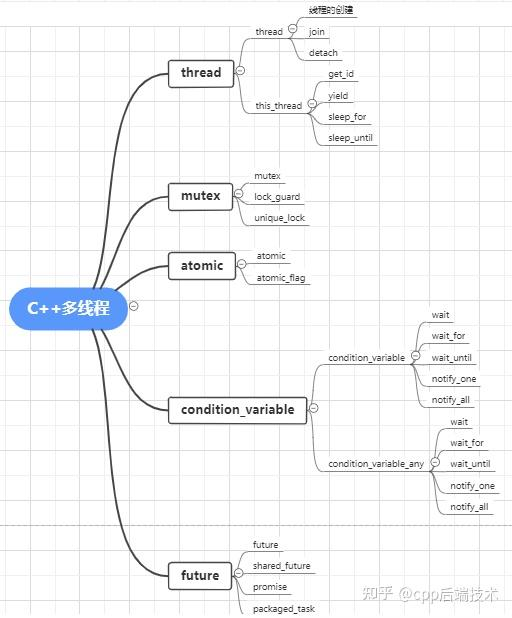

- [多进程](#多进程)
- [进程间通信](#进程间通信)
- [进程间同步](#进程间同步)
- [多线程](#多线程)

## 多进程

```cpp
// 父进程返回子进程的PID（>0）
// 子进程返回0
// 失败返回-1
#include <unistd.h>
#include <iostream>

int main() {
    pid_t pid = fork();
    if (pid == -1) {
        std::cerr << "Fork failed\n";
        return 1;
    } else if (pid == 0) {
        std::cout << "Child process, PID: " << getpid() << std::endl;
    } else {
        std::cout << "Parent process, Child PID: " << pid << std::endl;
    }
    return 0;
}


// 使用exec执行新程序，替换当前程序
#include <unistd.h>

int main() {
    execl("/bin/ls", "ls", "-l", nullptr); // 替换为执行 ls -l
    return 0; // 仅在 exec 失败时执行
}
```
## 进程间通信
```cpp
// 1. 匿名管道（Pipe）
#include <unistd.h>
#include <string.h>
#include <iostream>

int main() {
    int fd[2];
    if (pipe(fd) == -1) {
        std::cerr << "Pipe failed\n";
        return 1;
    }

    pid_t pid = fork();
    if (pid == 0) { // 子进程读数据
        close(fd[1]); // 关闭写端
        char buf[100];
        read(fd[0], buf, sizeof(buf));
        std::cout << "Child received: " << buf << std::endl;
        close(fd[0]);
    } else { // 父进程写数据
        close(fd[0]); // 关闭读端
        const char* msg = "Hello from parent!";
        write(fd[1], msg, strlen(msg) + 1);
        close(fd[1]);
    }
    return 0;
}


// 2. 共享内存（Shared Memory）
#include <sys/mman.h>
#include <sys/wait.h>
#include <unistd.h>
#include <iostream>

int main() {
    int size = 4096;
    void* shm = mmap(nullptr, size, PROT_READ | PROT_WRITE, 
                     MAP_SHARED | MAP_ANONYMOUS, -1, 0);
    if (shm == MAP_FAILED) {
        std::cerr << "mmap failed\n";
        return 1;
    }

    pid_t pid = fork();
    if (pid == 0) {
        // 子进程读取数据
        std::cout << "Child read: " << static_cast<char*>(shm) << std::endl;
        munmap(shm, size);
    } else {
        // 父进程写入数据
        sprintf(static_cast<char*>(shm), "Hello via shared memory!");
        wait(nullptr); // 等待子进程结束
        munmap(shm, size);
    }
    return 0;
}


// 3. 信号（Signal）
#include <signal.h>
#include <unistd.h>
#include <iostream>

void handler(int sig) {
    std::cout << "Received signal: " << sig << std::endl;
}

int main() {
    signal(SIGUSR1, handler); // 注册信号处理函数
    pid_t pid = fork();
    if (pid == 0) {
        // 子进程向父进程发送信号
        kill(getppid(), SIGUSR1);
    } else {
        pause(); // 等待信号
    }
    return 0;
}
```
## 进程间同步
```cpp
// 1. 信号量（Semaphore）
#include <fcntl.h>
#include <sys/stat.h>
#include <semaphore.h>
#include <iostream>
#include <unistd.h>

int main() {
    sem_t* sem = sem_open("/my_semaphore", O_CREAT, 0644, 1); // 初始值1
    if (sem == SEM_FAILED) {
        std::cerr << "Semaphore open failed\n";
        return 1;
    }

    pid_t pid = fork();
    if (pid == 0) {
        sem_wait(sem); // 获取信号量
        std::cout << "Child entered critical section\n";
        sleep(2);
        sem_post(sem); // 释放信号量
    } else {
        sem_wait(sem);
        std::cout << "Parent entered critical section\n";
        sleep(2);
        sem_post(sem);
        sem_unlink("/my_semaphore");
    }
    return 0;
}
```
## 多线程
C++11标准中引入了5个头文件来支持多线程编程，如下图所示：

```cpp
// t.join()函数阻塞主线程，直到t线程完成
#include <iostream>
#include <thread>

void print_hello() {
    std::cout << "Hello from thread!" << std::endl;
}

int main() {
    std::thread t(print_hello);  // 创建一个线程并启动
    t.join();  // 等待线程结束
    return 0;
}


// 互斥锁
#include <iostream>
#include <thread>
#include <mutex>

std::mutex mtx;

void print_hello(int id) {
    std::lock_guard<std::mutex> lock(mtx);  // 自动加锁，作用域结束时自动释放锁
    std::cout << "Hello from thread " << id << std::endl;
}

int main() {
    std::thread t1(print_hello, 1);
    std::thread t2(print_hello, 2);
    
    t1.join();
    t2.join();
    
    return 0;
}


// 条件变量
#include <iostream>
#include <thread>
#include <mutex>
#include <condition_variable>

std::mutex mtx;
std::condition_variable cv;
bool ready = false;

void print_id(int id) {
    std::unique_lock<std::mutex> lock(mtx);
    while (!ready) {
        cv.wait(lock);  // 等待条件满足
    }
    std::cout << "Thread " << id << '\n';
}

void go() {
    std::unique_lock<std::mutex> lock(mtx);
    ready = true;
    cv.notify_all();  // 通知所有等待的线程
}

int main() {
    std::thread threads[10];
    for (int i = 0; i < 10; ++i) {
        threads[i] = std::thread(print_id, i);
    }
    
    std::cout << "10 threads ready to race...\n";
    go();  // 激活线程
    
    for (auto& t : threads) {
        t.join();
    }
    
    return 0;
}


// 原子操作
#include <iostream>
#include <thread>
#include <atomic>

std::atomic<int> counter(0);

void increase() {
    for (int i = 0; i < 1000; ++i) {
        counter.fetch_add(1, std::memory_order_relaxed);  // 原子递增
    }
}

int main() {
    std::thread t1(increase);
    std::thread t2(increase);
    
    t1.join();
    t2.join();
    
    std::cout << "Counter: " << counter.load() << std::endl;  // 获取原子变量的值
    return 0;
}


// 通过std::async和std::future实现异步执行
#include <iostream>
#include <future>

int square(int x) {
    return x * x;
}

int main() {
    std::future<int> result = std::async(std::launch::async, square, 5);
    std::cout << "Square of 5 is: " << result.get() << std::endl;  // 获取返回结果
    return 0;
}
```