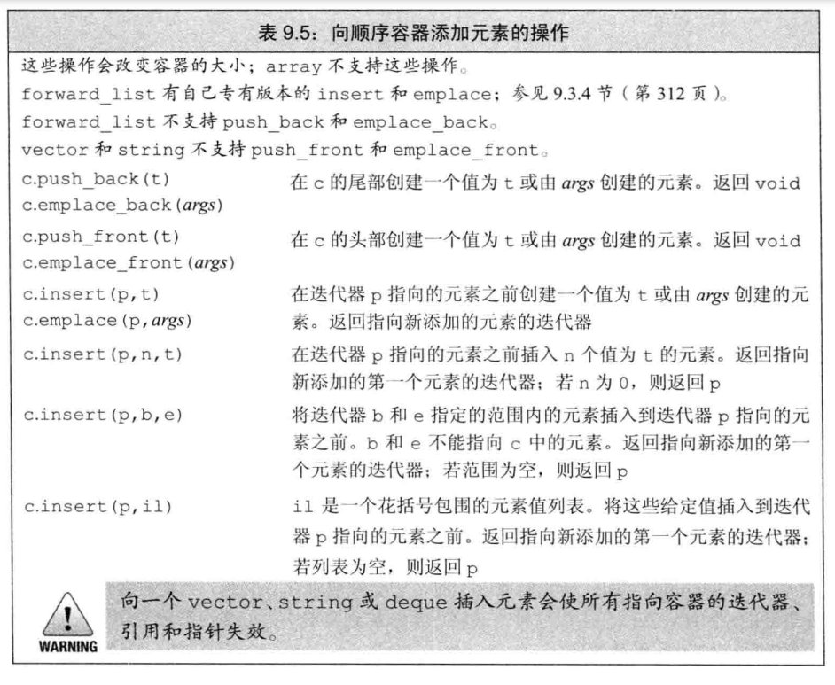
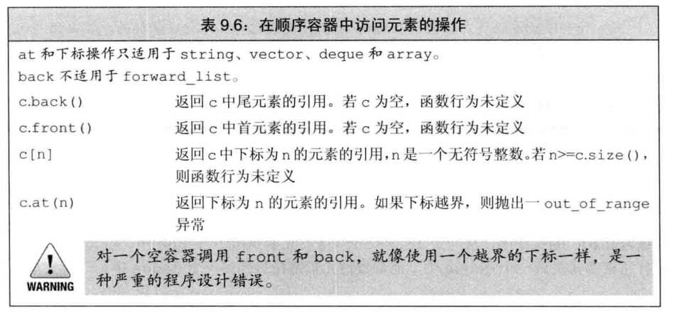
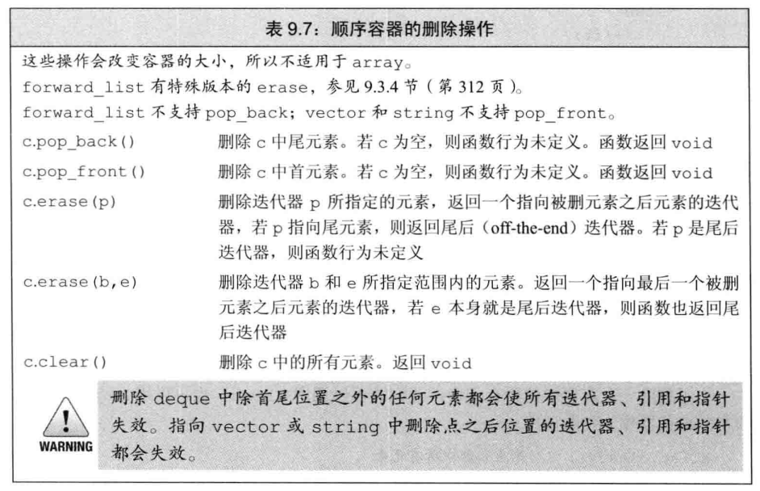
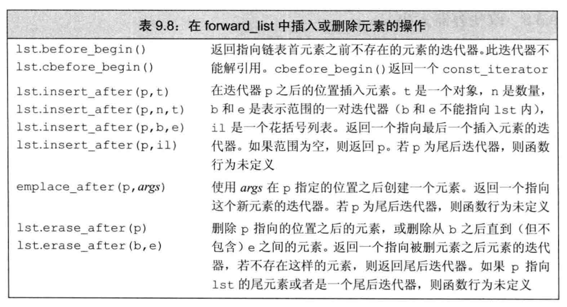
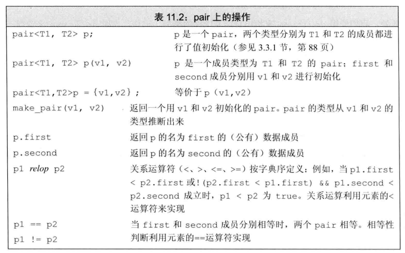
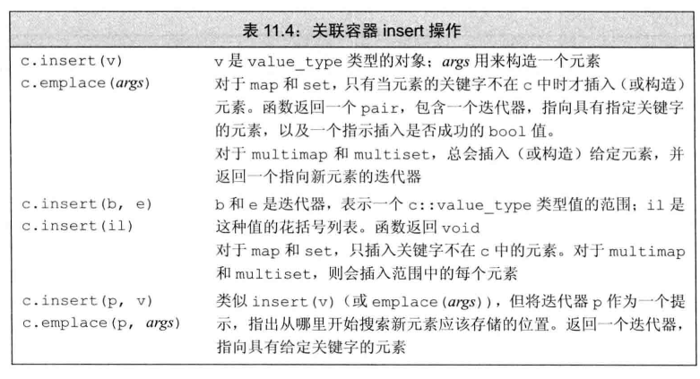
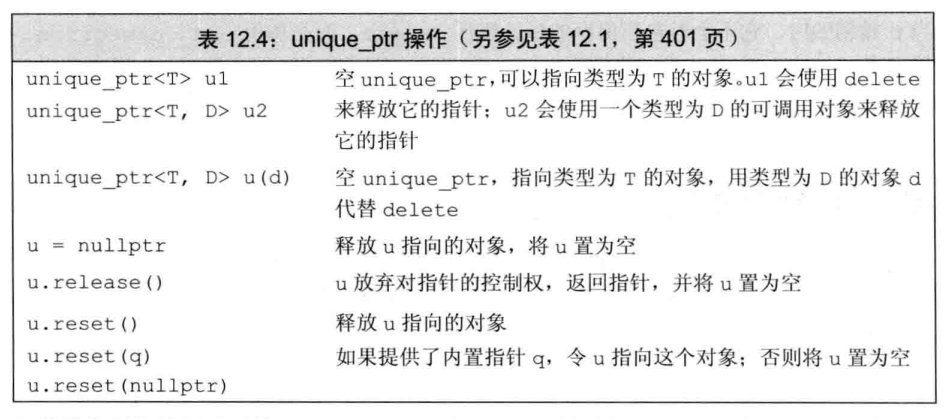
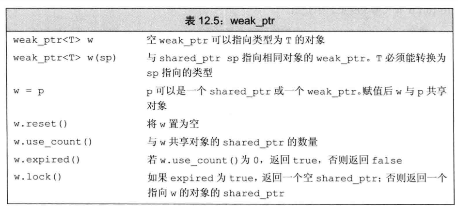
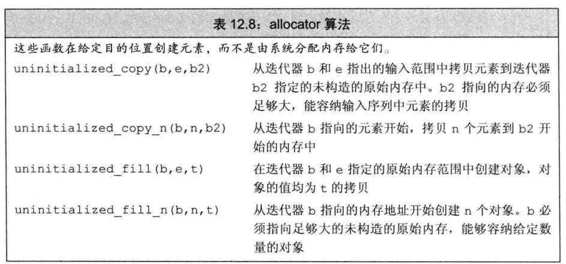

- [C++标准](#C++标准)
- [C++中的预定义宏](#C++中的预定义宏)
- [C++基本语法](#C++基本语法)
	- [引用](#引用)
	- [指针](#指针)
	- [定义指针的引用](#定义指针的引用)
	- [const限定符](#const限定符)
	- [constexpr和常量表达式](#constexpr和常量表达式)
	- [类型别名](#类型别名)
	- [auto类型说明符](#auto类型说明符)
	- [decltype类型说明符](#decltype类型说明符)
	- [多维数组](#多维数组)
	- [强制类型转换](#强制类型转换)
	- [`.*`和`->*`操作符](#`.*`和`->*`操作符)
	- [switch语句](#switch语句)
	- [可变数量形参](#可变数量形参)
	- [尾置返回类型](#尾置返回类型)
	- [assert预处理宏](#assert预处理宏)
	- [内联函数和constexpr函数](#内联函数和constexpr函数)
	- [this](#this)
	- [构造函数](#构造函数)
	- [友元](#友元)
	- [类型成员](#类型成员)
	- [可变数据成员](#可变数据成员)
	- [类内初始值](#类内初始值)
	- [类类型的转换](#类类型的转换)
	- [explicit](#explicit)
	- [类的静态成员](#类的静态成员)
	- [lambda表达式](#lambda表达式)
- [标准库](#标准库)
	- [常用库](#常用库)
	- [常用函数](#常用函数)
	- [bind函数](#bind函数)
	- [io库](#io库)
	- [顺序容器](#顺序容器)
	- [vector](#vector)
	- [string](#string)
	- [array](#array)
	- [deque](#deque)
	- [forward_list中插入或删除元素](#forward_list中插入或删除元素)
	- [容器适配器](#容器适配器)
	- [获取内置数组迭代器](#获取内置数组迭代器)
	- [泛型算法](#泛型算法)
	- [迭代器](#迭代器)
	- [关联容器](#关联容器)
	- [共享指针](#共享指针)
	- [allocator类](#allocator类)
	- [拷贝构造函数](#拷贝构造函数)
	- [析构函数](#析构函数)
	- [右值引用](#右值引用)
	- [移动构造函数和移动赋值运算符](#移动构造函数和移动赋值运算符)
	- [noexcept](#noexcept)
	- [引用限定符](#引用限定符)
	- [重载运算符](#重载运算符)
	- [类型转换运算符](#类型转换运算符)
	- [继承](#继承)
	- [虚函数](#虚函数)
	- [模板](#模板)
	- [类模板和友元](#类模板和友元)
	- [模板类型别名](#模板类型别名)
	- [类模板的static成员](#类模板的static成员)
	- [类模板的类型成员](#类模板的类型成员)
	- [默认模板实参](#默认模板实参)
	- [类模板的成员模板](#类模板的成员模板)
- [C语言一些知识点](#C语言一些知识点)
	- [预定义宏](#预定义宏)

# C++标准

# C++中的预定义宏
```cpp
// 参考网址：https://gcc.gnu.org/onlinedocs/cpp/Standard-Predefined-Macros.html
__cplusplus    // 表示当前使用的C++标准版本
__func__

__FUNCTION__    // 编译器提供该宏，g++和msvc都提供该宏
```
# C++基本语法
## 引用
```cpp
int val = 1024;
int &refVal = val;

// 引用必须初始化

// 因为引用本身不是一个对象，所以不能定义引用的引用

// 引用只能绑定在对象上，而不能与字面值或某个表达式的计算结果绑定在一起

// 引用并非对象，它只是为一个已经存在的对象所起的另外一个名字

// 引用的类型必须与其所引用对象的类型一致，但是有两个例外。第一种例外情况就是在初始化常量引用时允许用任意表达式作为初始值，只要该表达式的结果能转换成引用的类型即可
int i = 42;
const int &r1 = i;		// 允许将const int&绑定到一个普通int对象上
const int &r2 = 42;		// 正确：r2是一个常量引用
const int &r3 = r1 * 2;	// 正确：r3是一个常量引用
int &r4 = r1 * 2;		// 错误：r4是一个普通的非常量引用
```
## 指针
```cpp
// 指针的类型必须与其所指对象的类型一致，但是有两个例外。第一种例外情况是允许令一个指向常量的指针指向一个非常量对象
int i = 42;
const int *ptr = &i;
```
## 定义指针的引用
```cpp
int i = 0;
int *ptr = &i;
int *&r = ptr;   // r为指针ptr的引用
```
## const限定符
```cpp
// const对象必须初始化

// 用名词顶层const表示指针本身是个常量，而用名词底层const表示指针所指的对象是一个常量

// 顶层const可以表示任意的对象是常量，底层const则与指针和引用等符合类型的基本类型部分有关
int i = 42;
const int val = 42;		// 顶层const，即val这个对象是常量
int *const ptr = &i;	// 顶层const，即ptr这个对象是常量
const int *ptr2 = &i;	// 底层const，即ptr2所指的对象是一个常量
const int &r = i;		// 底层const，即r所引用的对象是一个常量，毕竟引用不是对象，只是一个别名，所以引用没有顶层const

// 默认情况下，const对象被设定为仅在文件内有效。当多个文件中出现了同名的const变量时，其实等同于在不同文件中分别定义了独立的变量
// 如果想在多个文件之间共享const对象，必须在变量的定义之前添加extern关键字
```
## constexpr和常量表达式
```cpp
// 常量表达式（const expression）是指值不会改变并且在编译过程就能得到计算结果的表达式。显然，字面值属于常量表达式，用常量表达
// 式初始化的const对象也是常量表达式

// C++11新标准规定，允许将变量声明为constexpr类型以便由编译器来验证变量的值是否是一个常量表达式。声明为constexpr的变量一定是
// 是一个常量，而且必须用常量表达式初始化
constexpr int i = 42;

// 常量表达式的值需要在编译时就得到计算，因此对声明constexpr时用到的类型必须有所限制。因为这些类型一般比较简单，值也显而易见，容
// 易得到，就把它们称为“字面值类型”（literal type）。算术类型、引用和指针都属于字面值类型，而自定义类型则不属于字面值类型

// 限定符constexpr仅对指针有效，与指针所指的对象无关
// constexpr把它所定义的对象置为了顶层const
constexpr int i = 42;
constexpr int *p = nullptr;		// p是一个指向整数的常量指针
constexpr const int *q = &i;	// q是常量指针，指向整型常量i
```
## 类型别名
```cpp
// 第一种方式
typedef double wages;
// 第二种方式
using wages = double;


typedef char *pstring;
const pstring cstr = 0;		// cstr是指向char的常量指针
const char *cstr2 = 0;		// cstr2是一个指向const char的指针，与上句不同的原因是*成为了声明符的一部分
```
## auto类型说明符
```cpp
// auto一般会忽略掉顶层const，同时底层const则会保留下来
int i;
const int ci = i, &cr = ci;
auto b = ci;	// b是一个整数（ci的顶层const特性被忽略掉了）
auto c = cr;	// c是一个整数（cr是ci的别名，ci本身是一个顶层const）
auto d = &i;	// d是一个整形指针（整数的地址就是指向整数的指针）
auto e = &ci;	// e是一个指向整数常量的指针（对常量对象取地址是一种底层const）
// 如果希望推断出的auto类型是一个顶层const，需要明确指出
const auto f = ci;	// ci的推演类型是int，f是const int
// 还可以将引用的类型设为auto，此时原来的初始化规则仍然适用
auto &g = ci;			// g是一个整形常量引用，绑定到ci
auto &h = 42;			// 错误：不能为非常量引用绑定字面值
const auto &j = 42;		// 正确：可以为常量引用绑定字面值
```
## decltype类型说明符
```cpp
// decltype处理顶层const和引用的方式与auto有些许不同。如果decltype使用的表达式是一个变量，则decltype返回该变量的类型（包
// 括顶层const和引用在内）
const int ci = 0, &cj = ci;
decltype(ci) x = 0;			// x的类型是const int
decltype(cj) y = x;			// y的类型是const int&，y绑定到变量x
decltype(cj) z;				// 错误：z是一个引用，必须初始化
// 因为cj是一个引用，decltype(cj)的结果就是引用类型，因此作为引用的z必须被初始化
// 需要指出的是，引用从来都作为其所指对象的同义词出现，只有用在decltype处是一个例外


int i = 42, *p = &i;
decltype(*p) c;			//错误：c是int&，必须初始化
// 如果表达式的内容是解引用操作，则decltype将得到引用类型。正如我们所熟悉的那样，解引用指针可以得到指针所指的对象，而且还能给这
// 个对象赋值。因此，decltype(*p)的结果类型就是int&，而非int
```

```cpp
// decltype的表达式如果是加上了括号的变量，结果将是引用
int i = 42;
decltype((i)) d;		// 错误：d是int&，必须初始化
decltype(i) e;			// 正确：e是一个（未初始化的）int
// decltype((variable))（注意是双层括号）的结果永远是引用，而decltype(variable)结果只有当variable本身就是一个引用时才是
// 引用
```
## 多维数组
```cpp
// 因为多维数组实际上是数组的数组，所以有多维数组名转化得来的指针实际上是指向第一个内层数组的指针
int ia[3][4];		// 大小为3的数组，每个元素是含有4个整数的数组
int (*p)[4] = ia;	// p指向含有4个整数的数组
p = &ia[2];			// p指向ia的尾元素
```
## 强制类型转换
```cpp
// static_cast
// 只要不包含底层const，就可以使用static_cast
const int i = 42;
double m = 42.42;
int j = static_cast<int>(i);
int n = static_cast<int>(m);


// const_cast
// const_cast只能改变运算对象的底层const
const char *pc;
char *p = const_cast<char*>(pc);

// 下面的代码会打印5567
int ok() {
    return 8834;
}
int main() {
    // i的初始值要通过调用函数的形式得到，原因是如果用字面值初始化编译器会在编译阶段将用到i的地方替换为对应的字面值，也就无法通
    // 过*p来修改i的值
    const int i = ok();
    const int *pc = &i;
    int *p = const_cast<int*>(pc);
    *p = 5567;
    cout << i << endl;
}


// reinterpret_cast
int *ip;
char *pc = reinterpret_cast<char*>(ip);	// reinterpret_cast实现了旧式的(char*)ip类型转换，这种转换上面这两种无法实现
```
## `.*`和`->*`操作符
```cpp
// 示例代码
#include <iostream>

class MyClass {
public:
    int value;
    MyClass(int v) : value(v) {}
};

int main() {
    MyClass obj(42); // 创建对象
    // 指向成员的指针
    int MyClass::*ptr_to_member = &MyClass::value;
    // 通过指针访问成员
    std::cout << "Value: " << obj.*ptr_to_member << std::endl;
    // 修改值
    obj.*ptr_to_member = 100;
    std::cout << "Updated Value: " << obj.*ptr_to_member << std::endl;
    return 0;
}

// 对于这句代码int MyClass::*ptr_to_member = &MyClass::value;
// 使用 &MyClass::value 取的是成员变量的“类型”，这个指针可以用于访问任何 MyClass 的实例（对象）中的 value 成员。
// 当你有一个类的实例（例如 obj），使用 obj.*ptr_to_member 可以访问或修改该实例中的 value 值。
// &MyClass::value 是一个指向成员的指针，可以用来在类的实例中访问该成员。

// 对于->*操作符，作用和.*相同
MyClass* obj = new MyClass(42);
int MyClass::*ptr_to_member = &MyClass::value;
obj->*ptr_to_member = 100;
```
## switch语句
```cpp
int i = 42;
switch (i) {
    case 1:
        break;
    case 2:
        break;
    default:
        break;
}

// switch语句会将括号内表达式的值转成整数类型，然后与每个case标签的值比较
// case关键字和它对应的值一起被称为case标签，case标签必须是整型常量表达式
// 任何两个case标签的值不能相同，否则就会引发错误，default也是一种特殊的case标签

// 下面这段代码是错误的，因为如果控制流跳到false分支，就会略过m的定义，而false之后的代码试图使用它们，这是显然行不通的。
// 因此C++语言规定，不允许跨过变量的初始化语句直接跳转到该变量作用域的另一个位置(goto也可以进行跳转)
switch (i) {
    case true:
        int m = 3;
        break;
    case false:
        m = 98;
        break;
}
```
## 可变数量形参
```cpp
// 第一种方法，initializer_list，要求全部实参类型都相同，initializer_list对象中的元素永远是常量值，无法改变它们的值
// initializer_list是一种标准库类型，定义在同名的头文件中
void ok(int i, initializer_list<string> li);
string s = "hello";
ok(42, {"cc", s, "world"});			// 传递实参给initializer_list时，需要将序列放在花括号内


// 第二种方法，省略符形参，应只用于c++和c的交互上
// 该方法使用了名为varargs的c标准库功能，需包含stdarg.h头文件
void foo(int count...); void foo(int count, ...); void foo(...);	// 共有这三种形式
// 使用方式
void foo(int count, ...) {
    va_list args;
    va_start(args, count);	// 初始化args，获取最后一个固定参数
    
    for (int i = 0; i < count; i++) {
        int value = va_arg(args, int);	// 获取下一个参数
        printf("%d\n", value);
    }
    
    va_end(args);	// 清理
}
// va_list: 用于声明一个可变参数列表
// va_start: 初始化va_list变量，以便访问可变参数，需要传递最后一个固定参数
// va_arg: 用于访问可变参数。需要指定要获取的参数类型
// va_end: 清理va_list，结束可变参数的访问
```
## 尾置返回类型
```cpp
auto func(int i) -> int (*)[10];	// 需要在本该出现返回类型的地方放置一个auto
```
## assert预处理宏
```cpp
arrert(expr);	// assert使用一个表达式作为它的条件，其定义在cassert头文件中
#define NDEBUG	//默认状态下没有定义NDEBUG，assert会执行，如果定义了NDEBUG，assert什么也不做

// __func__是c++编译器定义的一个局部静态变量，用于存放函数的名字
void print() {
    cout << __func__ << endl;
}
// 除了__func__外，预处理器还定义了另外4个对于程序调试很有用的名字
// __FILE__ 存放文件名的字符串字面值
// __LINE__ 存放当前行号的整型字面值
// __TIME__ 存放文件编译时间的字符串字面值
// __DATE__ 存放文件编译日期的字符串字面值
```
## 内联函数和constexpr函数
```cpp
// 内联函数和constexpr函数可以在程序中多次定义，多个定义必须完全一致
// constexpr函数被隐式的指定为内联函数
// constexpr函数本身不保证返回值是常量表达式，但它允许在满足条件时（传入常量参数、函数逻辑合
// 法）在编译期求值，此时返回值可以作为常量表达式使用
// 定义在类内部的函数是隐式的内联函数
inline void func() {}
constexpr int func() {return 0;}
```
## this
```cpp
// this是额外的隐式参数，当调用一个成员函数时，用请求该函数的对象地址初始化this。比如stu.eat()，可以等价的认为编译器将该
// 调用重写成立如下的形式：Student::eat(&stu)
// 默认情况下，this的类型是指向类类型非常量版本的常量指针，比如Student *const，所以不允许改变this中保存的地址
// 不能在一个常量对象上调用普通的成员函数，但可以调用常量成员函数，比如void eat() const;是Student类中的常量成员函数
```
## 构造函数
```cpp
// 只有当类没有声明任何构造函数时，编译器才会自动地生成默认构造函数
// 可以通过=default来要求编译器生成构造函数，和其他函数一样，如果=default在类的内部，则默认构造函数是内联的，如何在类的外部，
// 则该成员默认情况下不是内联的
```
## 友元
```cpp
// 类可以允许其他类或函数访问它的非公有成员，方法是令其他类或者函数成为它的友元（friend）
// 如果类想把一个函数作为它的友元，只需要增加一条以friend关键字开始的函数声明语句即可
// 友元不是类的成员，不受它所在区域访问控制级别的约束
// 如果一个类指定了友元类，则友元类的成员函数可以访问此类包括非公有成员在内的所有成员

// 也可以只把一个成员函数声明成友元
class Student {
  friend void Teacher::eat();  
};
```
## 类型成员
```cpp
class Student {
public:
    typedef std::string::size_type pos;
};
// 由类定义的类型名字和其他成员一样存在访问限制
// 用来定义类型的成员必须先定义后使用，因此，类型成员通常出现在类开始的地方
```
## 可变数据成员
```cpp
// 一个可变数据成员永远不会是const，即使它是const对象的成员。因此，一个const成员函数可以改变一个可变成员的值
class Student {
public:
    void func() const {++age;}
private:
    mutable int age;
};
```
## 类内初始值
```cpp
// 当提供一个类内初始值时，必须以符号=或者花括号表示
class Student {
private:
    int age(10);	// 错误，必须以符号=或者花括号表示
    int age{10};	// 正确
    int age = 10;	// 正确
    int age = {10};	// 正确
};
```
## 类类型的转换
```cpp
// 类类型能定义有编译器自动执行的转换，不过编译器每次只能执行一种类类型的转换
class A {
public:
    A(string s) {}
};

class B {
public:
    B(A a) {}
};

int main() {
    string s = "hello";
    B a(s);
    B b("hello");	// 错误，编译器每次只能执行一种类类型的转换
}
```
## explicit
```cpp
// 关键字explicit只对一个实参的构造函数有效，需要多个实参的构造函数不能用于执行隐式转换，所以无须将这些构造函数指定为explicit
// explicit关键字只允许出现在类内的构造函数声明处

// explicit构造函数只能用于直接初始化
// 发生隐式转换的一种情况是当执行拷贝形式的初始化时（使用=）。此时，只能使用直接初始化而不能使用explicit构造函数
class A {
public:
    explicit A(string s) {}
};
string s = "hello";
A a(s);		// 正确，直接初始化
A b = s;	// 错误，不能将explicit构造函数用于拷贝形式的初始化过程
```
## 类的静态成员
```cpp
// 在类的外部定义静态成员时，不能重复static关键字，该关键字只出现在类内部的声明语句
```
## lambda表达式
```cpp
// lambda表达式会被编译器翻译成一个未命名类的未命名对象，lambda产生的类中含有一个重载的函数调用运算符
// lambda不能有默认参数
// 捕获列表只用于局部非static变量，lambda可以直接使用局部static变量和在它所在函数之外声明的名字
// 一个lambda表达式具有如下形式
[capture list] (parameter list) -> return type { function body }
// 可以忽略参数列表和返回类型，但必须永远包含捕获列表和函数体
auto f = [] { return 42; };
```
# 标准库
## 常用库
```cpp
// io库
iostream		fstream		sstream
```
## 常用函数
```cpp
// getline()
#include <string>
string s;
getline(cin, s);

// swap()交换两个容器
swap(a, b)
```
## bind函数
```cpp
// bind函数定义在头文件functional中，可以将bind函数看作一个通用的函数适配器，它接受一个可调用对象，生成一个新的可调用对象来“适
// 应”原对象的参数列表
// bind参数列表中形如_n的参数是“占位符”
auto check6 = bind(check_size, std::placeholders::_1, 6);
string s = "hello";
bool b = check6(s);

// ref函数定义在头文件functional中，返回一个引用
ref(os);
```
## io库
```cpp
// 一个流一旦发生错误，其上后续的IO操作都会失败
// 到达文件结束位置，eofbit和failbit都会被置位
// 在badbit被置位时，fail()也会返回true


// 流的状态相关
cin.rdstate()		// 返回流的状态，返回值类型为stream::iostate
cin.fail()			// 若流的failbit或badbit置位，则返回true
cin.good()			// 若流处于有效状态，则返回true
cin.eof()			// 若流的eofbit置位，则返回true
cin.clear()			// 将流中所有条件状态为复位，将流的状态设置为有效，返回void
cin.clear(flags)	// 根据给定的flags标志位，将流中对应条件状态位复位，flags的类型为stream::iostate，返回void
cin.setstate(flags)	// 根据给定的flags标志位，将流中对应条件状态位置位，flags的类型为stream::iostate，返回void

    
// 流的操纵符相关
cout << "hi" << endl;		// 输出hi和一个换行，然后刷新缓冲区
cout << "hi" << flush;		// 输出hi，然后刷新缓冲区，不附加任何额外字符
cout << "hi" << ends;		// 输出hi和一个空字符，然后刷新缓冲区

cout << unitbuf;				// 	所有输出操作后都会立即刷新缓冲区
// 任何输出都立即刷新，无缓冲
cout << nounitbuf;				// 回到正常的缓冲方式


// 关联输入和输出流
// 当一个输入流被关联到一个输出流时，任何试图从输入流读取数据的操作都会先刷新关联的输出流
// 标准库将cout和cin关联在一起，保证了所有输出都会在读操作之前被打印出来
// 每个流同时最多关联到一个流，但多个流可以同时关联到同一个ostream
cin.tie(&cout);				// 仅仅是用来展示：标准库将cin和cout关联在一起
ostream *old_tie = cin.tie(nullptr);	// cin不再与其他流关联


// ---------------------------------------------------------------------------------------------------------
// 文件流fstream
// 当一个fstream对象被销毁时，close会自动被调用
// 一旦一个文件流已经打开，它就保持与对应文件的关联。对一个已经打开的文件流调用open会失败，并会导致failbit被置位，随后的试图使
// 用文件流的操作都会失败。为了将文件流关联到另外一个文件，必须首先关闭已经关联的文件
ofstream fstrm;				// 创建一个未绑定的文件流，
ofstream fstrm(s);			// 创建一个fstream，并打开名为s的文件，默认的文件模式mode依赖于fstream的类型
ofstream fstrm(s, mode);	// 与前一个构造函数类似，但按指定mode打开文件
fstrm.open(s)				// 打开名为s的文件，并将文件与fstrm绑定，默认的文件模式mode依赖于fstream的类型，返回void
fstrm.open(s, ofstream::app);	// 文件模式为输出和追加
fstrm.close()				// 关闭与fstrm绑定的文件，返回void
fstrm.is_open()				// 返回一个bool值，指出与fstrm关联的文件是否成功打开且尚未关闭
    
    
// 文件模式
// 每个文件流类型都定义了一个默认的文件模式，当我们未指定文件模式时，就使用此默认模式
// 与ifstream关联的文件默认以in模式打开，与ofstream关联的文件默认以out模式打开，与fstream关联的文件默认以in和out模式打开

// 以out模式打开的文件会被截断
// 以app模式打开的文件每次写操作前均定位到文件末尾，在app模式下，即使没有显示指定out模式，文件也总是以输出方式被打开
fstrm.open(s, ofstream::app);


// ---------------------------------------------------------------------------------------------------------
// string流
ostringstream strm;			// strm是一个未绑定的ostringstream对象
ostringstream strm(s);		// strm是一个ostringstream对象，保存string s的一个拷贝
strm.str()					// 返回strm所保存的string的拷贝
strm.str(S)					// 将string s拷贝到strm中，返回void
```
## 顺序容器
```cpp
// 顺序容器类型
vector、	deque、list、forward_list、array、string
    
// 顺序容器（array除外）还定义了一个名为assign的成员，允许我们从一个不同但相容的类型赋值，或者从容器的一个子序列赋值
list<string> names;
vector<const char*> oldstyle;
names = oldstyle;			// 错误：容器类型不匹配
// 正确：可以将const char*转换为string
names.assign(oldstyle.cbegin(), oldstyle.cend());
// 等价于slist1.clear();
// 后跟slist1.insert(slist1.begin(), 10, "Hiya!");
list<string> slist1(1);		// 1个元素，为空string
slist1.assign(10, "Hiya!");	// 10个元素，每个都是"Hiya!"
```



## vector
```cpp
// 只有在执行insert操作时size与capacity相等，或者调用resize或reserve时给定的大小超过当前capacity，vector才可能重新分配内
// 存空间。会分配多少超过给定容量的额外空间，取决于具体实现
```
## string
```cpp
// 
s.substr(pos, n);
s.append(args);
s.replace(range, args);

s.find(args);
s.rfind(args);
s.find_first_of(args);
s.find_last_of(args);
s.find_first_not_of(args);
s.find_last_not_of(args);

to_string(42);
stoi("12");
stol();
stoul();
stoll();
stoull();
stof();
stod();
stold();
```
## array
```cpp
// array大小固定，不支持添加或删除元素的操作
array<int, 10> arr;
```
## deque
```cpp
// deque支持在容器头尾位置的快速插入和删除，而且在两端插入和删除元素都不会导致重新分配空间
```
## forward_list中插入或删除元素
```cpp
// forward_list不支持push_back()、pop_back()、back()
```

## 容器适配器
```cpp
// 顺序容器适配器：stack、queue、priority_queue
// 默认情况下，stack和queue是基于deque实现的，priority_queue是在vector之上实现的
// 可以在创建一个适配器时将一个命名的顺序容器作为第二个类型参数，来重载默认容器类型

// 在vector上实现的空栈
stack<string, vector<string>> str_stk;
// str_stk2在vector上实现，初始化时保存svec的拷贝
stack<string, vector<string>> str_stk2(svec);

// stack的操作
s.pop();
s.push(item);
s.emplace(args);
s.top();

// queue和priority_queue的操作
q.pop();
q.front();
q.back();			// 只适用于queue
q.top();
q.push(item);
q.emplace(args);
```
## 获取内置数组迭代器
```cppp
#include <iostream>
int arr[] = {1, 2, 3};
find(begin(arr), end(arr), 2);
```
## 泛型算法
```cpp
// 泛型算法运行于迭代器之上而不会执行容器操作的特性带来了一个令人惊讶但非常必要的编程假定：算法永远不会改变底层容器的大小
// 但给插入器赋值时，它们会在底层的容器上执行插入操作，当算法操作一个这样的迭代器，迭代器可以完成向容器添加元素的效果，但算法自身
// 永远不会做这样的操作
// 大多数算法都定义在头文件algorithm中，标准库还在头文件numeric中定义了一组数值泛型算法

max_element(vec.begin(), vec.end());

// back_inserter接受一个指向容器的引用，返回一个与该容器绑定的插入迭代器，当我们通过此迭代器赋值时，赋值运算符会调用push_back
// 将一个具有给定值的元素加到容器中
// back_inserter是定义在头文件iterator中的一个函数
vector<int> vec;
auto it = back_inserter(vec);				// 通过它赋值会将元素添加到vec中
*it = 42;									// vec中现在有一个元素，值为42


#include <numeric>
accumulate(vec.begin(), vec.end(), 0);		// 第三个参数是和的初值，返回范围内元素的和
// equal算法接受三个迭代器，前两个表示第一个序列中的元素范围，第三个表示第二个序列的首元素
// 那些只接受一个单一迭代器来表示第二个序列的算法，都假定第二个序列至少与第一个序列一样长
equal(vec1.cbegin(), vec1.cend(), vec2.cbegin());


#include <algorithm>
find(vec.cbegin(), vec.cend(), val);		// 返回指向第一个等于给定值的元素的迭代器，若无匹配元素返回第二个参数
find_if(vec.cbegin(), vec.cend(), []{return true;});	// 
fill(vec.begin(), vec.end(), 0);			// 将每个元素重置为0
fill_n(vec.begin(), vec.size(), 0);			// 将所有元素重置为0

// replace算法接受4个参数：前两个是迭代器，表示输入序列，后两个一个是要搜索的值，另一个是新值，它将所有等于第一个值的元素替换为
// 第二个值
replace(vec.begin(), vec.end(), 0, 42);

// 如果我们希望保留原序列不变，可以调用replace_copy，此算法接受额外第三个迭代器参数，指出调整后序列的保存位置
replace_copy(vec.begin(), vec.end(), back_inserter(lst), 0, 42);

// replace_if
replace_if();

// unique重排输入范围，使得每个单词只出现一次，不重复的元素排列在范围的前部，返回指向不重复区域之后一个位置的迭代器
auto it = unique(words.begin(), words.end());

// sort进行排序
sort(vec.begin(), vec.end());

// stable_sort，稳定排序算法维持相等元素的原有顺序
stable_sort(vec.begin(), vec.end());

// for_each
for_each(words.begin(), words.end(), [](const string &s){cout << s << " ";});

// 函数transform接受三个迭代器和一个可调用对象。前两个迭代器表示输入序列，第三个迭代器表示目的位置。算法对输入序列中每个元素调用
// 可调用对象，并将结果写到目的位置
transform(vec.begin(), vec.end(), vec.begin(), [](int i) { return i < 0 ? -i : i; });

// copy
copy();
// unique_copy
unique_copy();

// upper_bound
upper_bound();
// lower_bound
lower_bound();

adjacent_find();
binary_search();
count();
count_if();
random_shuffle();
merge();
reverse();

set_intersection();		// 求两个容器的交集
set_union();			// 求两个容器的并集
set_difference();		// 求两个容器的差集
```
## 迭代器
```cpp
// 在头文件iterator中定义了额外几种迭代器
// 插入迭代器、流迭代器、反向迭代器、移动迭代器


// 插入迭代器
// it = t					// 插入元素
// *it, ++it, it++			// 这些操纵虽然存在，但不会对it做任何事情，每个操作都返回it
// 插入器有三种类型，back_inserter(底层push_back)、front_inserter(底层push_front)、inserter(底层inserter)


// 流迭代器
// istream_iterator、ostream_iterator
```
## 关联容器
```cpp
// 类型有map、set、multimap、multiset、unordered_map、unordered_set、unordered_multimap、unordered_multiset
// 类型map和multimap定义在头文件map中，set和multiset定义在头文件set中，无序容器则定义在头文件unordered_map和unordered_s
// et中
// 关联容器的迭代器都是双向的
// 由于一个unique_ptr拥有它指向的对象，因此unique_ptr不支持普通的拷贝或赋值操作

// pair类型定义在头文件utility中
```





## 共享指针
```cpp
// shared_ptr、unique_ptr、weak_ptr都定义在头文件memory中
// 使用new动态分配的对象是默认初始化的
// 传递给delete的指针必须指向动态分配的内存，或者是一个空指针。释放一块并非new分配的内存，或者将相同的指针值释放多次，其行为是未
// 定义的
// 当创建一个weak_ptr时，要用一个shared_ptr来初始化它

// 分配并初始化一个const int
const int *pci = new const int(1024);
// 类似其他任何const对象，一个动态分配的const对象必须进行初始化

// bad_alloc和nothrow都定义在头文件new中
// 如果分配失败，new返回一个空指针
int *p1 = new int;					// 如果分配失败，new抛出std::bad_alloc
int *p2 = new (nothrow) int;		// 如果分配失败，new返回一个空指针
```




## allocator类


## 拷贝构造函数
```cpp
// 如果一个构造函数的第一个参数是自身类类型的引用，且任何额外参数都有默认值，则此构造函数是拷贝构造函数
// 即使定义了其他构造函数，编译器也合成一个拷贝构造函数
```
## 析构函数
```cpp
// 析构函数不接受参数，因此也不能被重载。对一个给定类，只会有唯一一个析构函数
// 析构函数首先执行函数体，然后销毁成员，成员按初始化顺序的逆序销毁
```
## 右值引用
```cpp
// 不能将一个右值引用直接绑定到一个左值上
int &&rr = 42;

// move函数定义在头文件utility中
// 调用move函数可以获得绑定到左值上的右值引用
// 可以销毁一个移后源对象，也可以赋予它新值，但不能使用一个移后源对象的值
int i = 42;
int &&rr = std::move(i);
```
## 移动构造函数和移动赋值运算符
```cpp
// 不抛出异常的移动构造函数和移动赋值运算符必须标记为noexcept
```
## noexcept
```cpp
// 必须在类头文件的声明中和定义中（如果定义在类外的话）都指定noexcept
```
## 引用限定符
```cpp
// 被&限定的函数只能用于左值，被&&限定的函数只能用于右值
class Foo {
public:
    Foo sorted() &&;				// 可用于可改变的右值
    FOo sorted() const &;			// 可用于任何类型的Foo
private:
    vector<int> data;
};
```
## 重载运算符
```cpp
// 除了重载的函数调用运算符operator()之外，其他重载运算符不能含有默认实参
// 对于一个运算符函数来说，它或者是类的成员，或者至少含有一个类类型的参数
// 不能被重载的运算符有 ::		.*		.		?: 这四个


// 逻辑与和逻辑或运算符的重载版本无法保留内置运算符的短路求值属性，两个运算对象总是会被求值
// 一般不重载逗号运算符和取地址运算符，因为C++已经定义了这两种运算符用于类类型对象时的特殊含义
// 通常情况下，不应该重载逗号、取地址、逻辑与和逻辑或运算符

// 赋值（=）、下标（[]）、调用（()）和成员访问箭头（->）运算符必须是成员函数，输入输出运算符必须是非成员函数
// 具有对称性的运算符通常应该是普通的非成员函数，例如算术、相等性和关系运算符，其他运算符通常应该是成员函数

// operator+为非成员函数的话下面两种调用是等价的
Foo a, b;
a + b;
operator+(a, b);
```
## 类型转换运算符
```cpp
// 一个类型转换函数必须是类的成员函数；它不能声明返回类型，形参列表也必须为空。类型转换函数通常应该是const
operator int() const { return 42; }

// 显式的类型转换运算符必须通过显式的强制类型转换才会调用
// 但该规定存在一个例外，即如果表达式被用作条件，则编译器会将显示的类型转换自动应用于它
// 这是因为类定义向bool的类型转换是比较普遍的现象，但bool是一种算术类型，这样的类型转换可能引发意想不到的后果
explicit operator int() const { return 42; }
```
## 继承
```cpp
// 派生类必须使用基类的构造函数来初始化它的基类部分
// 通过使用using声明改变派生类继承的某个名字的访问级别
class A {
public:
    int i;
};
class B: private A {
public:
    using A::i;
};
```
## 虚函数
```cpp
// 虚函数可以有默认实参。如果某次函数调用使用了默认实参，则该实参值由本次调用的静态类型决定
// 派生类中虚函数的返回类型必须与基类函数匹配，该规则存在一个例外，当类中的虚函数返回类型是类本身的指针或引用时，上述规则无效
// 可以通过作用域运算符回避虚函数的机制
class A {
public:
    virtual void eat() {}
};
class B: public A {
public:
    void eat() override {}
};
B b;
A *a = &b;
a->A::eat();
```
## 模板
```cpp
// 模板定义以关键字template开始，后跟一个模板参数列表，模板参数列表不能为空
// 模板的实例化发生在编译时期
// 默认情况下，对于一个实例化了的类模板，其成员函数只有在使用时才被实例化
// 函数模板和类模板成员函数的定义通常放在头文件中

// 函数模板
template <typename T>
int compare(const T &v1, const T &v2) {
	if (v1 < v2) return -1;
	if (v2 < v1) return 1;
	return 0;
}
// 类模板成员函数
template <typename T>
void Teacher<T>::check() const {
	return 0;
}

// 在一个类模板的作用域内，我们可以直接使用模板名而不必指定模板实参
template <typename T>
Teacher<T> Teacher<T>::operator++(int) {
	Teacher ret = *this;    // 直接使用模板名
	++*this;
	return ret;
}

// 模板声明
template <typename T> int compare(const T&, const T&);
template <typename T> class Blob;

// 函数模板可以声明为inline或constexpr的，inline或constexpr说明符放在模板参数列表之后，返
// 回类型之前

// 函数模板和类模板成员函数的定义通常放在头文件中
// typename T或class T为类型参数，typename和class含义相同，可以混合使用
// int N为非类型参数，一个非类型参数表示一个值而非一个类型

// 一个非类型参数可以是一个整型，或者是一个指向对象或函数类型的指针或（左值）引用。绑定到非类
// 型整型参数的实参必须是一个常量表达式。绑定到指针或引用非类型参数的实参必须具有静态的生存期
// 。我们不能用一个普通（非static）局部变量或动态对象作为指针或引用非类型模板参数的实参。指针
// 参数也可以用nullptr或一个值为0的常量表达式来实例化。
// 在模板定义内，模板非类型参数是一个常量值。在需要常量表达式的地方，可以使用非类型参数。

// 除了定义类型参数，还可以在模板中定义非类型参数，非类型模板参数的模板实参必须是常量表达式
template <int N>
void eat() {
    return N;
}

// 模板类型别名
template<typename T> using twin = pair<T, T>;
twin<string> authors;			// authors是一个pair<string, string>

// 模板默认实参
template<typename M, typename N = int> class A {};
A<string, string> a;
A<string> b;							// 和A<string, int>相同

// 类外定义成员函数
template<typename T> class A {
  void eat();  
};
template<typename T>
void A<T>::eat() {}
```
## 类模板和友元
```cpp
// 一对一友好关系
// 前置声明，在Blob中声明友元所需要的
template <typename> class BlobPtr;
template <typename> class Blob;    // 运算符==中的参数所需要的
template <typename T>
	bool operator==(const Blob<T>&, const Blob<T>&);

template <typename T> class Blob {
	// 每个Blob实例将访问权限授予用相同类型实例化的BlobPtr和相等运算符
	friend class BlobPtr<T>;
	friend bool operator==<T>
		(const Blob<T>&, const Blob<T>&);
}


// 通用和特定的模板友好关系
// 前置声明，在将模板的一个特定实例声明为友元时要用到
template <typename T> class Pal;
class C {    // C是一个普通的非模板类
	friend class Pal<C>;    // 用类C实例化的Pal是C的一个友元
	// Pal2的所有实例都是C的友元；这种情况无须前置声明
	template <typename T> friend class Pal2;
};
template <typename T> class C2 {    // C2本身是一个类模板
	// C2的每个实例将相同实例化的Pal声明为友元
	friend class Pal<T>;    // Pal的模板声明必须在作用域之内
	// Pal2的所有实例都是C2的每个实例的友元，不需要前置声明
	template <typename X> friend class Pal2;
	// Pal3是一个非模板类，它是C2所有实例的友元
	friend class Pal3;    // 不需要Pal3的前置声明
};
// 为了让所有实例成为友元，友元声明中必须使用与类模板本身不同的模板参数


// 令模板自己的类型参数成为友元
template <typename Type> class Bar {
	friend Type;    // 将访问权限授予用来实例化Bar的类型
	//...
};
// 值得注意的是，虽然友元通常来说应该是一个类或是一个函数，但我们完全可以用一个内置类型来实例
// 化Bar。这种与内置类型的友好关系是允许的，以便我们能用内置类型来实例化Bar这样的类。
```
## 模板类型别名
```cpp
template <typename T> using twin = pair<T, T>;
twin<string> authors;    // authors是一个pair<string, string>

// 当我们定义一个模板类型别名时，可以固定一个或多个模板参数
template <typename T> using partNo = pair<T, unsigned>;
partNo<string> books;    // books是一个pair<string, unsigned>
```
## 类模板的static成员
```cpp
// 在类模板外定义static成员，类外定义不带static关键字
template <typename T>
size_t Foo<T>::ctr = 0;

// 可以通过类类型对象来访问一个类模板的static成员，也可以使用作用域运算符直接访问成员
Foo<int> fi;
int a = Foo<int>::count();
int b = fi.count();
```
## 类模板的类型成员
```cpp
// 默认情况下，C++语言假定通过作用域运算符访问的名字不是类型。因此，如果希望使用一个模板类型参
// 数的类型成员，就必须显式告诉编译器该名字是一个类型。通过使用关键字typename来实现这一点
template <typename T>
typename T::value_type top(const T& c) {
	if (!c.empty())
		return c.back();
	else
		return typename T::value_type();
}
// top函数期待一个容器类型的实参，它使用typename指明其返回类型并在c中没有元素时生成一个值初
// 始化的元素返回给调用者
```
## 默认模板实参
```cpp
template <class T = int> class Numbers {
public:
	Numbers(T v = 0): val(v) { }
private:
	T val;
};
Numbers<long double> lots_of_precision;
Numbers<> average_precision;    // 空<>表示希望使用默认类型
```
## 类模板的成员模板
```cpp
template <typename T>    // 类的类型参数
template <typename It>    // 构造函数的参数类型
	Blob<T>::Blob(It b, It e):
		data(std::make_shared<std::vector<T>>(b, e)) { }

int ia[] = {0, 1, 2};
Blob<int> a(begin(ia), end(ia));
```
# C语言一些知识点
## 预定义宏
```cpp
// 参考网址：https://gcc.gnu.org/onlinedocs/cpp/Standard-Predefined-Macros.html
__func__
__FILE__
__LINE__
__DATE__
__TIME__
__STDC__    // 如果编译器遵循ISO标准，则被定义为1
__STDC_VERSION__    // 表示当前使用的C标准版本

__FUNCTION__    // 编译器提供该宏，gcc提供该宏
```
