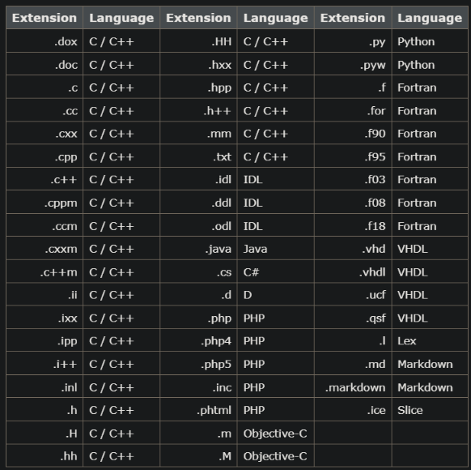

- [创建配置文件](#创建配置文件)

## 创建配置文件
```
Doxygen使用配置文件决定所有设置。
一个项目可以由一个源文件组成，也可以由一个会被递归扫描的源文件树组成。

创建一个模板配置文件：
doxygen -g <config-file>
如果省略文件名，一个叫Doxyfile的文件会被创建
如果使用 - 作为文件名，Doxygen会尝试从标准输入（stdin）读取配置文件

对于几个文件的小项目，可以将INPUT标签留为空，Doxygen会在当前目录搜索源文件。
对于一个包含文件树的大项目，应该将根目录赋予INPUT标签，并且赋予FILE_PATTERNS标签一个或多个文件模式（例如*.cpp，*.h），只有匹配这些模式的文件会被解析。递归解析文件树必须将RECURSIVE标签设为YES。进一步调整被解析的文件可以使用EXCLUDE和EXCLUDE_PATTERNS标签。
例如忽略文件树中所有test文件目录，可以使用：
EXCLUDE_PATTERNS = */test/*

Doxygen使用文件扩展名决定如何解析一个文件，见下表
```

```
将SOURCE_BROWER标签设为YES，会生成交叉引用
将INLINE_SOURCES标签设为YES，会将源文件直接包含进文档（例如方便代码审查）
```
## 生成文档
```
生成文档：
doxygen <config-file>
默认输出目录是启动doxygen的目录
输出目录可以通过OUTPUT_DIRECTORY改变
```
## 编写注释块
```
对代码中的每个实体来说有两种（某些情况下三种）类型的描述：简短描述和详细描述。
对成员方法和函数来说有第三种描述，叫做in body描述，由成员方法或函数内部的所有注释块组成。

将注释块标记为详细描述的几种方法：
第一种：
/**
 * ... text ...
 */
第二种：
/*!
 * ... text ...
 */
中间的*号可以省略
/*!
 ... text ...
*/
第三种（至少两行注释）：
///
/// ... text ...
///
或
//!
//!... text ...
//!
请注意，在这种情况下，空白行会结束文档块。
第四种：
/////////////////////////////////////////////////
/// ... text ...
/////////////////////////////////////////////////
或
/***********************************************
 *  ... text
 ***********************************************/


简短描述：
/// Brief description.
/** Detailed description. */
或
//! Brief description.

//! Detailed description
//! starts here.


doxygen允许将文档放在定义之前，以保持头文件紧凑

要记录 C++ 类的成员，还必须记录该类本身。命名空间也是如此。要记录全局C函数、typedef、枚举或预处理器定义，您必须首先记录包含它的文件（通常这将是一个头文件，因为该文件包含导出到其他源文件的信息）。

下面是使用结构命令记录的名为 structcmd.h 的 C 头文件的示例：
```
```cpp
/*! \file structcmd.h
    \brief A Documented file.

    Details.
*/

/*! \def MAX(a,b)
    \brief A macro that returns the maximum of \a a and \a b.

    Details.
*/

/*! \var typedef unsigned int UINT32
    \brief A type definition for a .

    Details.
*/

/*! \var int errno
    \brief Contains the last error code.

    \warning Not thread safe!
*/

/*! \fn int open(const char *pathname,int flags)
    \brief Opens a file descriptor.

    \param pathname The name of the descriptor.
    \param flags Opening flags.
*/

/*! \fn int close(int fd)
    \brief Closes the file descriptor \a fd.
    \param fd The descriptor to close.
*/

/*! \fn size_t write(int fd,const char *buf, size_t count)
    \brief Writes \a count bytes from \a buf to the filedescriptor \a fd.
    \param fd The descriptor to write to.
    \param buf The data buffer to write.
    \param count The number of bytes to write.
*/

/*! \fn int read(int fd,char *buf,size_t count)
    \brief Read bytes from a file descriptor.
    \param fd The descriptor to read from.
    \param buf The buffer to read into.
    \param count The number of bytes to read.
*/

#define MAX(a,b) (((a)>(b))?(a):(b))
typedef unsigned int UINT32;
int errno;
int open(const char *,int);
int close(int);
size_t write(int,const char *, size_t);
int read(int,char *,size_t);
```