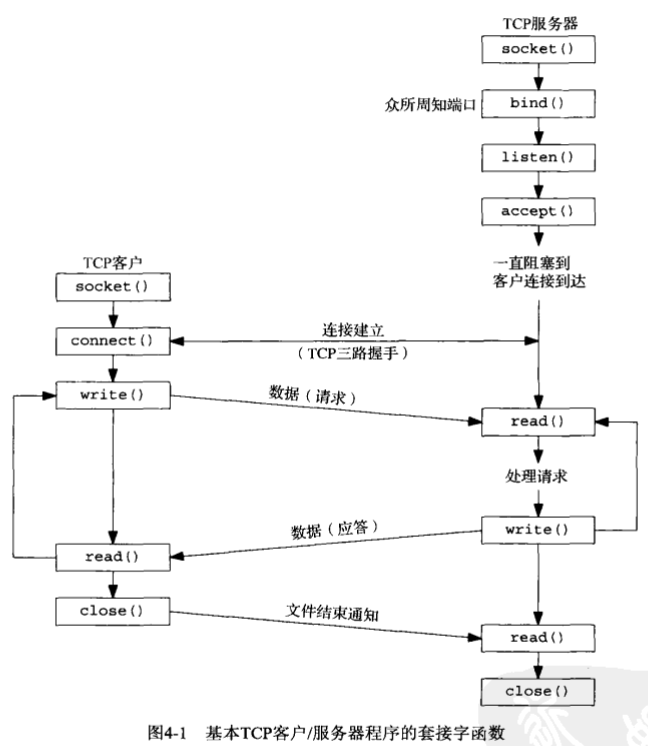

- [流程图](#流程图)
- [示例](#示例)
	- [服务器端](#服务器端)
	- [客户端](#客户端)
- [套接字函数](#套接字函数)
- [I/O模型](#I/O模型)
- [select等函数](#select等函数)
- [字节序转换](#字节序转换)
- [read等函数](#read等函数)
- [字节操纵函数](#字节操纵函数)
- [线程pthread](#线程pthread)
- [其他函数](#其他函数)

- [进程间通信方式](#进程间通信方式)

## 流程图

## 示例
### 服务器端
```cpp
int listenfd = socket(AF_INET, SOCK_STREAM, 0);

sockaddr_in servaddr, cliaddr;
socklen_t clilen;
bzero(&servaddr, sizeof(servaddr));
servaddr.sin_family = AF_INET;
servaddr.sin_addr.s_addr = htonl(INADDR_ANY);
servaddr.sin_port = htons(51453);

bind(listenfd, (struct sockaddr*)&servaddr, sizeof(servaddr));
listen(listenfd, 5);
int connfd = accept(listenfd, (struct sockaddr*)&cliaddr, &clilen);
```
### 客户端
```cpp
int sockfd = socket(AF_INET, SOCK_STREAM, 0);

sockaddr_in servaddr;
bzero(&servaddr, sizeof(servaddr));
servaddr.sin_family = AF_INET;
servaddr.sin_port = htons(51453);
inet_pton(AF_INET, "127.0.0.1", &servaddr.sin_addr);

connect(fd, (struct sockaddr*)&servaddr, sizeof(servaddr));
```
## 套接字函数
```c
// socket, bind, connect, accept, listen, shutdown, getsockname, getpeername
#include <sys/types.h>
#include <sys/socket.h>
int socket(int domain, int type, int protocol);
int bind(int sockfd, const struct sockaddr *addr, socklen_t addrlen);
int listen(int sockfd, int backlog);
int accept(int sockfd, struct sockaddr *addr, socklen_t *addrlen);
int connect(int sockfd, const struct sockaddr *addr, socklen_t addrlen);

// close函数关闭套接字，成功返回0，出错返回-1
#include <unistd.h>
int close(int sockfd);

// sockaddr_in使用，sockaddr_in和socklen_t都定义在<netinet/in.h>中
#include <netinet/in.h>
sockaddr_in servaddr;
bzero(&servaddr, sizeof(servaddr));
servaddr.sin_family = AF_INET;
servaddr.sin_addr.s_addr = htonl(INADDR_ANY);
servaddr.sin_port = htons(51453);
// 通过(struct sockaddr*)&servaddr将sockaddr_in转换为sockaddr
bind(sockfd, (struct sockaddr*)&servaddr, sizeof(servaddr));


// domain表示协议族，常用值为AF_INET和AF_INET6，分别表示IPv4和IPv6
// type表示套接字类型，常用值为SOCK_STREAM和SOCK_DGRAM，分别表示字节流和数据报，即TCP和UDP
// 返回值叫做套接字描述符，因为和文件描述符类似，通常用sockfd表示
// 一般来说protocol只有一个值与特定domain和type对应，这种情况置为0即可。日常使用该值置0即可
int socket(int domain, int type, int protocol);

// bind函数把一个本地协议地址赋予一个套接字
int bind(int sockfd, const struct sockaddr *addr, socklen_t addrlen);

// 当socket函数创建一个套接字时，它被假设为一个主动套接字，也就是说，它是一个将调用connect发
// 起连接的客户套接字。listen函数把一个未连接的套接字转换为一个被动套接字，指示内核应接受指向
// 该套接字的连接请求。
// Linux2.2之后，backlog参数在TCP套接字上的行为变了。现在指定的是完全建立连接的套接字等待被
// accept的队列长度，而不是未完成连接请求的数量
int listen(int sockfd, int backlog);

// accept函数由TCP服务器调用，用于从已完成连接队列队头返回下一个已完成连接。如果已完成连接队
// 列为空，那么进程被投入睡眠（假定套接字为默认的阻塞方式）。
// 参数addr和addrlen用来返回已连接的对端进程（客户）的协议地址。addrlen是值-结果参数：调用
// 前，我们将由*addrlen所引用的整数值置为由addr所指的套接字地址结构的长度，返回时，该整数值
// 即为由内核存放在该套接字地址结构内的确切字节数。
// 如果accept成功，那么其返回值是由内核自动生成的一个全新描述符，代表与所返回客户的TCP连接。
// 在讨论accept函数时，我们称它的第一个参数为监听套接字描述符，称它的返回值为已连接套接字描述
// 符。
// 如果我们对返回客户协议地址不感兴趣，那么可以把addr和addrlen均置为空指针。
int accept(int sockfd, struct sockaddr *addr, socklen_t *addrlen);

// 第二个、第三个参数分别是一个指向套接字地址结构的指针和该结构的大小
// 套接字地址结构必须含有服务器的IP地址和端口号
int connect(int sockfd, const struct sockaddr *addr, socklen_t addrlen);
```
## I/O模型
```cpp
// Unix下的5种I/O模型：阻塞式I/O，非阻塞式I/O，I/O复用，信号驱动式I/O，异步I/O
```
## select等函数
```c
// select
#include <sys/select.h>
int select(int nfds, fd_set *readfds, fd_set *writefds, fd_set *exceptfds, struct timeval *timeout);

// poll
#include <poll.h>
int poll(struct pollfd *fds, nfds_t nfds, int timeout);

// epoll
#include <sys/epoll.h>
int epoll_create(int size);
int epoll_ctl(int epfd, int op, int fd, struct epoll_event *event);  (op : EPOLL_CTL_ADD, EPOLL_CTL_MOD, EPOLL_CTL_DEL)
typedef union epoll_data {
	void 	*ptr;
	int 	fd;
	uint32_t	u32;
	uint64_t 	u64;
} epoll_data_t;
struct epoll_event {
	uint32_t 		events;
	epoll_data_t	data;
}
(events : EPOLLIN, EPOLLOUT, EPOLLRDHUP, EPOLLPRI, EPOLLERR, EPOLLHUP, EPOLLET, EPOLLONESHOT)
int epoll_wait(int epfd, struct epoll_event *events, int maxevents, int timeout);
```
## 字节序转换
```c
// htonl, htons, ntohl, ntohs, inet_pton，inet_ntop
#include <arpa/inet.h>
uint32_t htonl(uint32_t hostlong);
uint16_t htons(uint16_t hostshort);
uint32_t ntohl(uint32_t netlong);
uint16_t ntohs(uint16_t netshort);

// 推荐使用下面两个函数进行字节序转换
int inet_pton(int af, const char *src, void *dst); (af : AF_INET, AF_INET6);
const char *inet_ntop(int af, const void *src, char *dst, socklen_t size);
```
## read等函数
```c
// close, write, read
#include <unistd.h>
int close(int fd);
ssize_t write(int fd, const void *buf, size_t count);
ssize_t read(int fd, void *buf, size_t count);
```
## 字节操纵函数
```cpp
#include <string.h>
void *memset(void *dest, int c, size_t n);
void *memcpy(void *dest, const void *src, size_t n);
int memcmp(const void *ptr1, const void *ptr2, size_t n);
```
## 线程pthread
```
同一进程内的所有线程共享：
全局变量
进程指令
大多数数据
打开的文件（即描述符）
信号处理函数和信号处置
当前工作目录
用户ID和组ID

不过每个线程有各自的：
线程ID
寄存器集合，包括程序计数器和栈指针
栈（用于存放局部变量和返回地址）
errno
信号掩码
优先级
```

```cpp
#include <pthread.h>
// 成功返回0，出错返回正的Exxx值
// tid是新线程的ID，如果新的线程成功创建，其ID就通过tid指针返回
// attr指定线程的属性，通常把attr参数置为空指针，表示采纳默认设置
int pthread_create(pthread_t *tid, const pthread_attr_t *attr,
                   void *(*func)(void *), void *arg);

// 成功返回0，出错返回正的Exxx值
// 如果status指针非空，来自所等待线程的返回值（一个指向某个对象的指针）将存入由status指向的
// 位置
int pthread_join(pthread_t *tid, void **status);

// 返回调用线程的线程ID
pthread_t pthread_self(void);

// 成功返回0，出错返回正的Exxx值
// 常用于让本线程脱离，pthread_detach(pthread_self());
int pthread_detach(pthread_t tid);

// 如果本线程未曾脱离，它的线程ID和退出状态将一直留存到调用进程内的某个其他线程对它调用
// pthread_join。
// 指针status不能指向局部于调用线程的对象，因为线程终止时这样的对象也消失。
void pthread_exit(void *status);


// 互斥锁
// 如果试图上锁已被另外某个线程锁住的一个互斥锁，本线程将被阻塞，直到该互斥锁被解锁为止。
// 成功返回0，出错返回正的Exxx值
#include <pthread.h>
int pthread_mutex_lock(pthread_mutex_t *mptr);
int pthread_mutex_unlock(pthread_mutex_t *mptr);

// 条件变量
// 如果不使用条件变量，那么线程会不断检查互斥锁是否解锁，这种方法称为轮询（polling），相当浪
// 费CPU时间。使用条件变量可以让未得到互斥锁的线程进入睡眠，直到某个线程通知它有事可做才醒来。
// 成功返回0，出错返回正的Exxx值
#include <pthread.h>
int pthread_cond_wait(pthread_cond_t *cptr, pthread_mutex_t *mptr);
int pthread_cond_signal(pthread_cond_t *cptr);
int pthread_cond_broadcast(pthread_cond_t *cptr);
int pthread_cond_timedwait(pthread_cond_t *cptr, pthread_mutex_t *mptr,
						   const struct timespec *abstime);
```
## 其他函数
```
getsockname, getpeername

sprintf, snprintf, sscanf, fgets, fprintf

strcat, substr

getenv

// fork函数的返回值在子进程中为0，在父进程中为子进程ID，出错则为-1
#include <unistd.h>
pid_t fork(void);

// wait，waitpid等待子进程终止
// 函数wait和waitpid均返回两个值：已终止子进程的进程ID号，以及通过statloc指针返回的子进程终
// 止状态（一个整数）
#include <sys/wait.h>
pid_t wait(int *statloc);
pid_t waitpid(pid_t pid, int *statloc, int options);

getpid

execl, execlp, execle, execv, execvp, execvpe
这6个exec函数之间的区别在于：（a）待执行的程序文件是由文件名还是由路径名指定；（b）新程序的参数是一一列出还是由一个指针数组来引用；（c）把调用进程的环境传递给新程序还是给新程序指定新的环境。
这些函数只在出错时才返回到调用者。否则，控制将被传递给新程序的起始点，通常就是main函数。一般来说，只有execve是内核中的系统调用，其他5个都是调用execve的库函数。


wait, waitpid

exit

fgetc, fgets, getc, getchar, ungetc

fputc, fputs, putc, putchar, puts

lseek

fileno

gethostbyname

pthread_create, 

perror

getopt

getsockopt

setsockopt

socketpair

getcwd

calloc

sem_init
```
## 进程间通信方式
```
4种不同的进程间通信形式：
（1）消息传递（管道、FIFO、消息队列）
（2）同步（互斥锁、条件变量、读写锁、文件和记录锁、信号量）
（3）共享内存（匿名的和具名的）
（4）远程过程调用（RPC）
```

```cpp
// 管道
// 该函数返回两个文件描述符：fd[0]和fd[1]。前者打开来读，后者打开来写。
#include <unistd.h>
int pipe(int fd[2]);

// FIFO
// 每个FIFO有一个路径名与之关联，FIFO也称为有名管道
// 成功返回0，出错返回-1
// pathname是一个普通的Unix路径名，它是该FIFO的名字
// mode参数指定文件权限位
#include <sys/types.h>
#include <sys/stat.h>
int mkfifo(const char *pathname, mode_t mode);
```