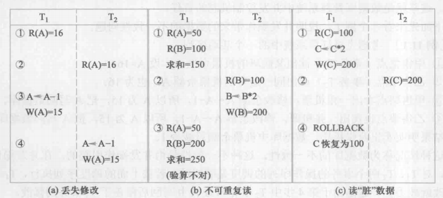
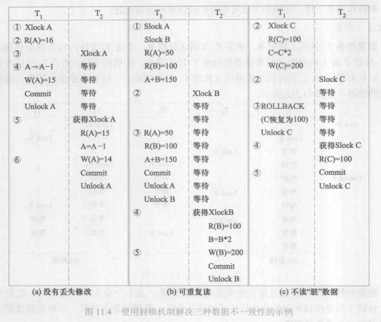

- [mysql语法](#mysql语法)
	- [基本语法](#基本语法)
- [Windows上使用](#Windows上使用)
	- [MySQL Shell](#MySQL Shell)
	- [MySQL Command Line Client](#MySQL Command Line Client)
- [数据库相关知识](#数据库相关知识)

# mysql语法

## 基本语法

```mysql
基础篇：

mysql -h (主机名) -P (端口号) -u (用户名) -p

SQL语句：
DDL语句： 	数据库操作
			SHOW DATABASES;
			CREATE DATABASE 数据库名;
			USE 数据库名;
			SELECT DATABASE();
			DROP DATABASE 数据库名;

			表操作
			SHOW TABLES;
			CREATE TABLE 表名(
				字段 字段类型 [约束条件],			// 约束条件可以有NOT NULL, UNIQUE, PRIMARY KEY, AUTO_INCREMENT, DEFAULT, CHECK, FROEIGN KEY
				...
			);
			DESC 表名;
			SHOW CREATE TABLE 表名;
			ALTER TABLE 表名 ADD/MODIFY/CHANGE/DROP/RENAME TO ...;
			DROP TABLE 表名;

DML语句：	INSERT INTO 表名(字段1，字段2) VALUES(值1，值2),(值1，值2);
			UPDATE 表名 SET 字段1=值1, 字段2=值2 [WHERE 条件];
			DELETE FROM 表名 [WHERE 条件];

DQL语句：	SELECT
				字段列表
			FROM
				表名
			WHERE
				条件列表			> >= < <= = <> like between...and in and or !
			GROUP BY
				分组字段列表
			HAVING
				分组后条件列表
			ORDER BY
				排序字段列表		ASC DESC
			LIMIT
				分页参数			

DCL语句：	CREATE USER '用户名'@'主机名' IDENTIFIED BY '密码';
			ALTER USER '用户名'@'主机名' IDENTIFIED WITH mysql_native_password BY '密码';
			DROP USER '用户名'@'主机名';

			GRANT 权限列表 ON 数据库名.表名 TO '用户名'@'主机名';
			REVOKE 权限列表 ON 数据库名.表名 FROM '用户名'@'主机名';

函数：		1.字符串函数
			CONCAT, LOWER, UPPER, LPAD, RPAD, TRIM, SUBSTRING
			2.数值函数
			CEIL, FLOOR, MOD, RAND, ROUND
			3.日期函数
			CURDATE, CURTIME, NOW, YEAR, MONTH, DAY, DATE_ADD, DATEDIFF
			4.流程函数
			IF, IFNULL, CASE [...] WHEN ... THEN ... ELSE ... END

多表查询：	内连接
				隐式：SELECT ... FROM 表A, 表B WHERE 条件...
				显示：SELECT ... FROM 表A INNER JOIN 表B ON 条件...
			外连接：
				左外：SELECT ... FROM 表A LEFT JOIN 表B ON 条件...
				右外：SELECT ... FROM 表A RIGHT JOIN 表B ON 条件...
			自连接：
			子查询：标量子查询，列子查询，行子查询，表子查询

事务：
	事务是一组操作的集合，这组操作，要么全部执行成功，要么全部执行失败。

	START TRANSACTION;
	COMMIT;
	ROLLBACK;

	事务四大特性ACID
	原子性(Atomicity)，一致性(Consistency)，隔离性(Isolation)，持久性(Durability)

	并发事务问题
	脏读，不可重复读，幻读

	事务隔离级别
	READ UNCOMMITED, READ COMMITED, REPEATABLE READ, SERIAILIZABLE
```

# Windows上使用
## MySQL Shell
```
在Windows上安装mysql后，可以启动mysql shell来编写和运行一些代码。
mysql shell中的命令都以\开头。
mysql shell可以使用js、python和sql语言，切换语言命令为\js或\py或\sql。
```

```
连接本地数据库：
\connect root@localhost
```
## MySQL Command Line Client
```
在Windows上安装mysql后，可以启动MySQL Command Line Client以连接并操作数据库。
```

## 数据库相关知识
保证数据一致性是对数据库的最基本的要求。
## 事务的概念
```
事务是用户定义的一个数据库操作序列，这些操作要么全做，要么全不做，是一个不可分割的工作单位
事务通常是以BEGIN TRANSACTION开始，以COMMIT或ROLLBACK结束
COMMIT表示提交，即提交事务的所有操作，即将对数据库的更新写到磁盘上，事务正常结束
ROLLBACK表示回滚，系统将事务中对数据库的所有已完成的操作全部撤销，回滚到事务开始时的状态
```
## 事务的ACID特性
```
事务具有四个特性：原子性（Atomicity）、一致性（Consistency）、隔离性（Isolation）和持续性（Durability）

原子性：
事务是数据库的逻辑工作单位，事务中包括的诸操作要么都做，要么都不做
一致性：
事务执行的结果必须是使数据库从一个一致性状态变到另一个一致性状态。因此当数据库只包含成功事务提交的结果时，就说数据库处于一致性状态
隔离性：
一个事务的执行不能被其他事务干扰。即一个事务的内部操作及使用的数据对其他并发事务是隔离的，并发执行的各个事务之间不能相互干扰
持续性：
也称永久性，指一个事务一旦提交，它对数据库中数据的改变就应该是永久性的


事务ACID特性可能遭到破坏的因素有：
（1）多个事务并行运行时，不同事务的操作交叉执行
（2）事务在运行过程中被强行停止
在第一种情况下，数据库管理系统必须保证多个事务的交叉运行不影响这些事务的原子性；在第二种情况下，数据库管理系统必须保证被强行终止的事务对数据库和其他事务没有任何影响
```
## 并发控制
```
并发操作带来的数据不一致性包括丢失修改、不可重复读和读“脏”数据
```

```
并发控制机制就是要用正确的方式调度并发操作，使一个用户事务的执行不受其他事务的干扰
并发控制的主要技术有封锁（locking）、时间戳（timestamp）、乐观控制法（optimistic scheduler）和多版本并发控制（multi-version concurrency control，MVCC）等
```
## 封锁
```
基本的封锁类型有两种：排他锁（exclusive locks，简称X锁）和共享锁（share locks，简称S锁）
排他锁又称为写锁，共享锁又称为读锁
```

```
一级封锁协议：
事务T在修改数据R之前必须先对其加X锁，直到事务结束才释放。事务结束包括正常结束（COMMIT）和非正常结束（ROLLBACK）
二级封锁协议：
在一级封锁协议基础上增加事务T在读取数据R之前必须先对其加S锁，读完后即可释放S锁
三级封锁协议：
在一级封锁协议基础上增加事务T在读取数据R之前必须先对其加S锁，直到事务结束才释放

一级封锁协议可防止丢失修改，并保证事务T是可恢复的
二级封锁协议除防止了丢失修改，还可进一步防止读“脏”数据
三级封锁协议除了防止丢失修改和读“脏”数据外，还进一步防止了不可重复读
```


## 活锁和死锁

```
避免活锁的简单方法是采用先来先服务的策略
解决死锁主要有两类方法，一类是预防死锁的发生，一类是允许发生死锁，但定期诊断并解除

诊断死锁的方法与操作系统类似，一般使用超时法或事务等待图法
```
## 可串行化调度
```
定义：多个事务的并发执行是正确的，当且仅当其结果与按某一次序串行地执行这些事务时的结果相同，称这种调度策略为可串行化（serializable）调度
可串行性（serializability）是并发事务正确调度的准则。按这个准则规定，一个给定的并发调度，当且仅当它是可串行化的，才认为是正确调度
```
## E-R图和UML
```
E-R图提供了表示实体型、属性和联系的方法。
实体型用矩形表示，属性用椭圆形表示，联系用菱形表示
```

```
表示E-R图的方法有若干种，使用统一建模语言UML是其中之一
```