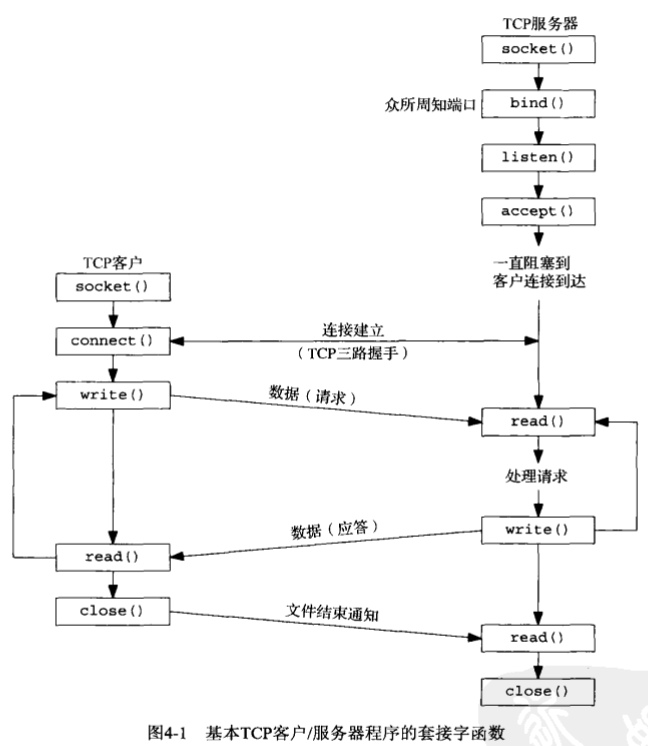

- [流程图](#流程图)
- [套接字函数](#套接字函数)
- [select等函数](#select等函数)
- [字节序转换](#字节序转换)
- [read等函数](#read等函数)
- [其他函数](#其他函数)

## 流程图

## 套接字函数
```c
// socket, bind, connect, accept, listen, shutdown, getsockname, getpeername
#include <sys/types.h>
#include <sys/socket.h>
int socket(int domain, int type, int protocol);
int bind(int sockfd, const struct sockaddr *addr, socklen_t addrlen);
int listen(int sockfd, int backlog);
int accept(int sockfd, struct sockaddr *addr, socklen_t *addrlen);
int connect(int sockfd, const struct sockaddr *addr, socklen_t addrlen);


// domain表示协议族，常用值为AF_INET和AF_INET6，分别表示IPv4和IPv6
// type表示套接字类型，常用值为SOCK_STREAM和SOCK_DGRAM，分别表示字节流和数据报，即TCP和UDP
// 返回值叫做套接字描述符，因为和文件描述符类似，通常用sockfd表示
int socket(int domain, int type, int protocol);

// bind函数把一个本地协议地址赋予一个套接字
int bind(int sockfd, const struct sockaddr *addr, socklen_t addrlen);

// 当socket函数创建一个套接字时，它被假设为一个主动套接字，也就是说，它是一个将调用connect发
// 起连接的客户套接字。listen函数把一个未连接的套接字转换为一个被动套接字，指示内核应接受指向
// 该套接字的连接请求。
// Linux2.2之后，backlog参数在TCP套接字上的行为变了。现在指定的是完全建立连接的套接字等待被
// accept的队列长度，而不是未完成连接请求的数量
int listen(int sockfd, int backlog);

// accept函数由TCP服务器调用，用于从已完成连接队列队头返回下一个已完成连接。如果已完成连接队
// 列为空，那么进程被投入睡眠（假定套接字为默认的阻塞方式）。
// 参数addr和addrlen用来返回已连接的对端进程（客户）的协议地址。addrlen是值-结果参数：调用
// 前，我们将由*addrlen所引用的整数值置为由addr所指的套接字地址结构的长度，返回时，该整数值
// 即为由内核存放在该套接字地址结构内的确切字节数。
// 如果accept成功，那么其返回值是由内核自动生成的一个全新描述符，代表与所返回客户的TCP连接。
// 在讨论accept函数时，我们称它的第一个参数为监听套接字描述符，称它的返回值为已连接套接字描述
// 符。
// 如果我们对返回客户协议地址不感兴趣，那么可以把addr和addrlen均置为空指针。
int accept(int sockfd, struct sockaddr *addr, socklen_t *addrlen);

// 第二个、第三个参数分别是一个指向套接字地址结构的指针和该结构的大小
// 套接字地址结构必须含有服务器的IP地址和端口号
int connect(int sockfd, const struct sockaddr *addr, socklen_t addrlen);
```
## select等函数
```c
// select
#include <sys/select.h>
int select(int nfds, fd_set *readfds, fd_set *writefds, fd_set *exceptfds, struct timeval *timeout);

// poll
#include <poll.h>
int poll(struct pollfd *fds, nfds_t nfds, int timeout);

// epoll
#include <sys/epoll.h>
int epoll_create(int size);
int epoll_ctl(int epfd, int op, int fd, struct epoll_event *event);  (op : EPOLL_CTL_ADD, EPOLL_CTL_MOD, EPOLL_CTL_DEL)
typedef union epoll_data {
	void 	*ptr;
	int 	fd;
	uint32_t	u32;
	uint64_t 	u64;
} epoll_data_t;
struct epoll_event {
	uint32_t 		events;
	epoll_data_t	data;
}
(events : EPOLLIN, EPOLLOUT, EPOLLRDHUP, EPOLLPRI, EPOLLERR, EPOLLHUP, EPOLLET, EPOLLONESHOT)
int epoll_wait(int epfd, struct epoll_event *events, int maxevents, int timeout);
```
## 字节序转换
```c
// htonl, htons, ntohl, ntohs, inet_pton，inet_ntop
#include <arpa/inet.h>
uint32_t htonl(uint32_t hostlong);
uint16_t htons(uint16_t hostshort);
uint32_t ntohl(uint32_t netlong);
uint16_t ntohs(uint16_t netshort);
int inet_pton(int af, const char *src, void *dst); (af : AF_INET, AF_INET6);
const char *inet_ntop(int af, const void *src, char *dst, socklen_t size);
```
## read等函数
```c
// close, write, read
#include <unistd.h>
int close(int fd);
ssize_t write(int fd, const void *buf, size_t count);
ssize_t read(int fd, void *buf, size_t count);
```
## 其他函数
```
sprintf, snprintf, sscanf, fgets, fprintf

bzero, bcopy, bcmp

memset, memcopy

strcat, substr

getenv

fork

execl, execlp, execle, execv, execvp, execvpe
这6个exec函数之间的区别在于：（a）待执行的程序文件是由文件名还是由路径名指定；（b）新程序的参数是一一列出还是由一个指针数组来引用；（c）把调用进程的环境传递给新程序还是给新程序指定新的环境。
这些函数只在出错时才返回到调用者。否则，控制将被传递给新程序的起始点，通常就是main函数。一般来说，只有execve是内核中的系统调用，其他5个都是调用execve的库函数。


wait, waitpid

exit

fgetc, fgets, getc, getchar, ungetc

fputc, fputs, putc, putchar, puts

lseek

fileno

gethostbyname

pthread_create, 

perror

getopt

setsockopt

socketpair

getopt

getcwd

calloc

sem_init
```