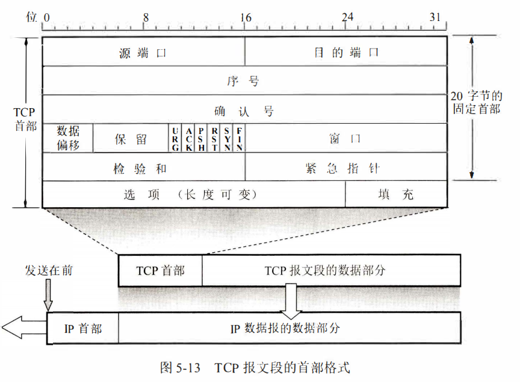
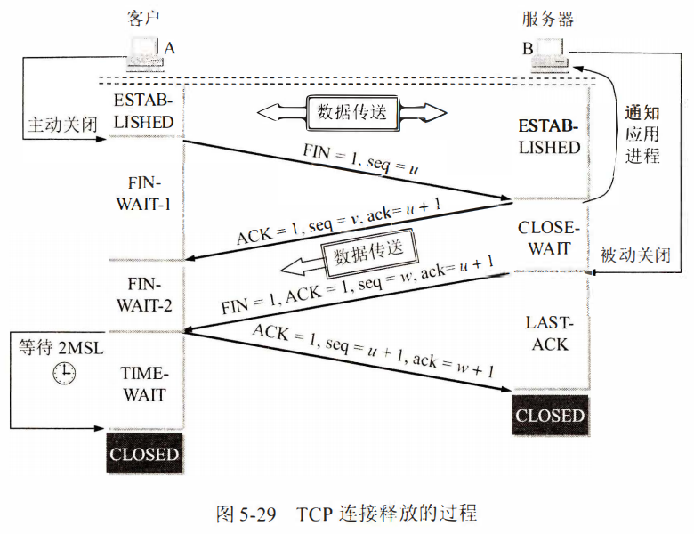
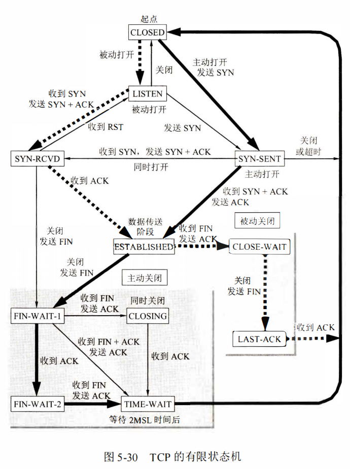

- [计算机网络体系结构](#计算机网络体系结构)
- [TCP](#TCP)
- [UDP](#UDP)

# 计算机网络体系结构

# TCP
```
TCP的主要特点：
（1）面向连接。
（2）每一条TCP连接只能是点对点的（一对一）。
（3）提供可靠交付的服务。通过TCP连接传送的数据，无差错、不丢失、不重复，而且按序到达。
（4）提供全双工通信。
（5）面向字节流。

每一条TCP连接唯一地被通信两端的两个端点（即套接字对socket pair）所确定。

理想的传输条件有以下两个特点：
（1）传输信道不产生差错。
（2）不管发送方以多快的速度发送数据，接收方总是来得及处理收到的数据。
```

```
TCP报文段首部的前20个字节是固定的，因此TCP首部的最小长度是20字节。

最大报文段长度MSS（Maximum Segment Size）是一个TCP报文段中的数据字段的最大长度。
MSS的默认值是536字节（这个数值来自576字节的IP数据报总长度减去TCP和IP的固定首部）。

TCP首部中的确认号是期望收到对方下一个报文段的第一个数据字节的序号。若确认号为N，则表明：到序号N-1为止的所有数据都已正确收到。
```

```
TCP进行拥塞控制的算法有四种，即慢开始、拥塞避免、快重传和快恢复。
```

## TCP的连接建立（三报文握手）

```
	为什么A最后还要发送一次确认呢？这主要是为了防止已失效的连接请求报文段突然又传送到了B，因而产生错误。
	所谓已失效的连接请求报文段是这样产生的。即A发出的第一个连接请求报文段并没有丢失，而是在某些网络节点长时间滞留了，以致延误到连接释放以后的某个时间才到达B。本来这是一个早已失效的报文段。但B收到此失效的连接请求报文段后，就误认为是A又发出一次新的连接请求。于是就向A发出确认报文段，同意建立连接。假定不采用报文握手，那么只要B发出确认，新的连接就建立了。
	由于现在A并没有发出建立连接的请求，因此不会理睬B的确认，也不会向B发送数据。但B却以为新的运输连接已经建立了，并一直等待A发来数据。B的许多资源就这样白白浪费了。
```
## TCP的连接释放（四报文挥手）

```
	时间MSL叫作最长报文段寿命（Maximum Segment Lifetime）。
	为什么A在TIME-WAIT状态必须等待2MSL的时间呢？这有两个理由。
	第一，为了保证A发送的最后一个ACK报文段能够到达B。这个ACK报文段有可能丢失，因而使处在LAST-ACK状态的B收不到对已发送的FIN+ACK报文段的确认。B会超时重传这个FIN+ACK报文段，而A就能在2MSL时间内收到这个重传的FIN+ACK报文段。接着A重传一次确认，重新启动2MSL计时器。最后，A和B都正常进入到CLOSED状态。如果A在TIME-WAIT状态不等待一段时间，而是在发送完ACK报文段后立即释放连接，那么就无法收到B重传的FIN+ACK报文段，因而也不会再发送一次确认报文段。这样，B就无法按照正常步骤进入CLOSED状态。
	第二，防止上一节提到的“已失效的连接请求报文段”出现在本连接中。A在发送完最后一个ACK报文段后，再经过时间2MSL，就可以使本连接持续的时间内所产生的所有报文段都从网络中消失。这样就可以使下一个新的连接中不会出现这种旧的连接请求报文段。
	B只要收到了A发出的确认，就进入CLOSED状态。同样，B在撤销相应的传输控制块TCB后，就结束了这次的TCP连接。我们注意到，B结束TCP连接的时间要比A早一些。
```
## TCP的有限状态机

# UDP
```
UDP的主要特点：
（1）无连接。
（2）尽最大努力交付。
（3）面向报文。
（4）无拥塞控制。
（5）支持一对一、一对多、多对一和多对多的交互通信。
（6）首部开销小（只有四个字段：源端口、目的端口、长度和检验和）。
```
