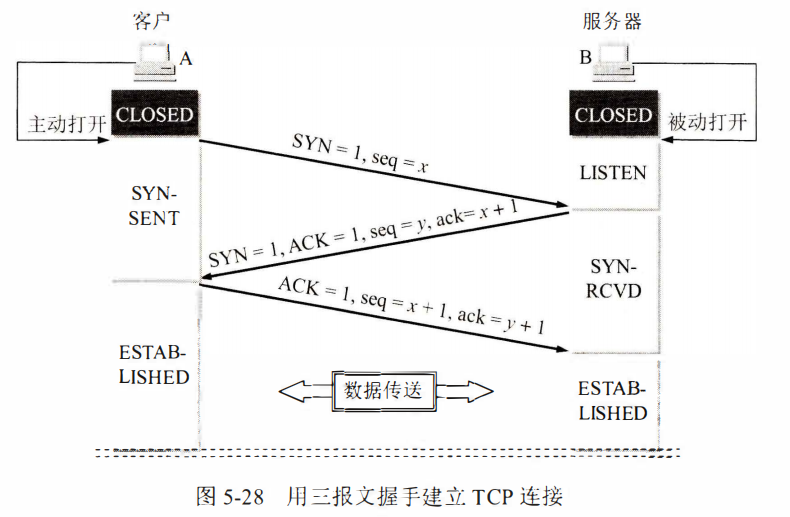
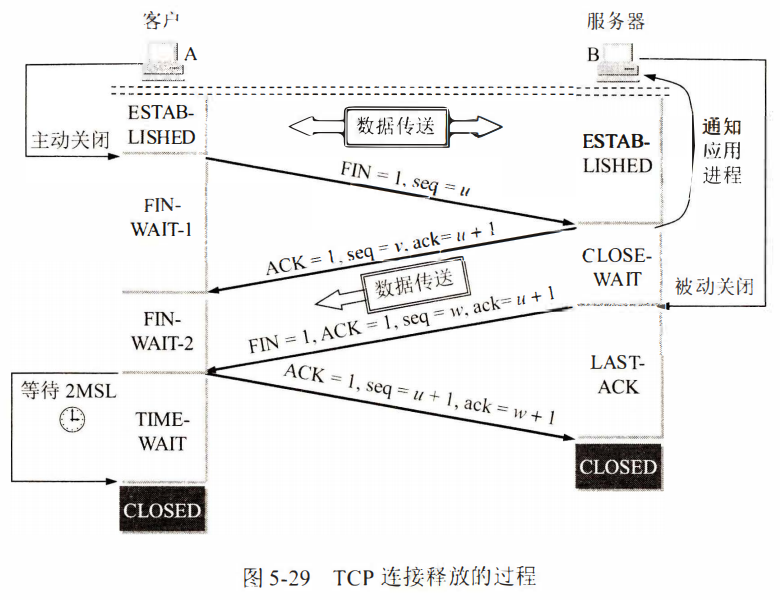

- [操作系统](#操作系统)
	- [进程和线程的区别](#进程和线程的区别)
	- [进程调度算法有哪些](#进程调度算法有哪些)
	- [什么是大端，小端，如何判断大端小端](#什么是大端，小端，如何判断大端小端)
	- [什么是孤儿进程，什么是僵尸进程](#什么是孤儿进程，什么是僵尸进程)
	- [进程通信的方式有哪些](#进程通信的方式有哪些)
	- [进程有哪几种状态](#进程有哪几种状态)
	- [死锁是什么，产生的条件，如何预防死锁](#死锁是什么，产生的条件，如何预防死锁)
	- [虚拟内存和物理内存](#虚拟内存和物理内存)
	- [分页，分段](#分页，分段)
	- [动态分区分配算法有哪几种](#动态分区分配算法有哪几种)
- [计算机网络](#计算机网络)
	- [TCP三次握手过程](#TCP三次握手过程)
	- [TCP四次挥手过程](#TCP四次挥手过程)
	- [TCP握手为什么是三次，不是两次](#TCP握手为什么是三次，不是两次)
	- [为什么需要time_wait](#为什么需要time_wait)
	- [TCP如何实现可靠传输](#TCP如何实现可靠传输)
	- [HTTP常见状态码](#HTTP常见状态码)
	- [HTTP和HTTPS的区别](#HTTP和HTTPS的区别)
	- [GET和POST的区别](#GET和POST的区别)
	- [HTTPS加解密的过程是怎么样的](#HTTPS加解密的过程是怎么样的)
	- [浏览器从输入URL开始到页面显示内容，中间发生了什么](#浏览器从输入URL开始到页面显示内容，中间发生了什么)
	- [TCP粘包拆包](#TCP粘包拆包)
	- [TCP和UDP的区别](#TCP和UDP的区别)
	- [HTTP1.0，1.1，2.0区别](#HTTP1.0，1.1，2.0区别)
- [C++](#C++)
	- [面向对象的三大特性](#面向对象的三大特性)
	- [C++中的四种类型转换](#C++中的四种类型转换)
	- [C++中的多态](#C++中的多态)
	- [虚表指针和虚函数表的初始化](#虚表指针和虚函数表的初始化)
	- [堆和栈的区别](#堆和栈的区别)
	- [malloc实现](#malloc实现)
- [数据库](#数据库)
	- [MySQL索引，以及它们的好处和坏处](#MySQL索引，以及它们的好处和坏处)
	- [索引失效](#索引失效)
	- [事务的ACID特性](#事务的ACID特性)
	- [事务隔离级别](#事务隔离级别)
- [Linux](#Linux)
	- [常用的Linux命令](#常用的Linux命令)
	- [gdb常见的调试命令](#gdb常见的调试命令)
	- [静态库和动态库如何制作及使用](#静态库和动态库如何制作及使用)
	- [静态库和动态库的区别](#静态库和动态库的区别)
	- [select，poll，epoll的区别](#select，poll，epoll的区别)
- [Linux高性能服务器](#Linux高性能服务器)
	- [Reactor和Proactor事件处理模式](#Reactor和Proactor事件处理模式)
- [其他问题](#其他问题)
	- [常用设计模式](#常用设计模式)
		- [单例模式](#单例模式)
		- [工厂模式](#工厂模式)
		- [观察者模式](#观察者模式)
		- [装饰器模式](#装饰器模式)
		- [策略模式](#策略模式)
		- [适配器模式](#适配器模式)
		- [代理模式](#代理模式)
		- [命令模式](#命令模式)
		- [组合模式](#组合模式)
		- [迭代器模式](#迭代器模式)
	- [软件开发流程](#软件开发流程)

# 操作系统
## 进程和线程的区别
```
进程是操作系统分配资源的基本单位，而线程是CPU调度和执行的基本单位
进程间的资源和地址空间是相互独立的，而同一进程的线程共享资源
进程切换的开销大，而线程切换的开销相对较小
```
## 进程调度算法有哪些
```
先来先服务 first-come first-servered(FCFS)，短作业优先 shortest job first(SJF)，时间片轮转，高响应比优先，优先级调度，多级反馈队列
```
## 什么是大端，小端，如何判断大端小端
```cpp
// 小端指的是一个整数的低位字节存放在低地址处，大端指的是一个整数的低位字节存放在高地址处


// 判断大端小端
#include <cstdio>
int main() {
    union {
    short value;
    char bytes[sizeof(short)];
    } test;

    test.value = 0x0102;
    if (test.bytes[0] == 2)
        printf("小端字节序");
    else if (test.bytes[0] == 1)
        printf("大端字节序");

    return 0;
}
```
## 什么是孤儿进程，什么是僵尸进程
```
孤儿进程是指一个父进程退出后，它的子进程仍在运行，这些子进程便成为了孤儿进程，孤儿进程会被init进程收养，孤儿进程一般不会产生任何危害

僵尸进程是指子进程结束，而父进程还没有回收子进程的资源，那么子进程就成为了僵尸进程
```
## 进程通信的方式有哪些
```
无名管道，有名管道（FIFO），消息队列，信号，信号量，共享内存，套接字，文件
```
## 进程有哪几种状态
```
创建、就绪、执行、阻塞、终止
```
## 死锁是什么，产生的条件，如何预防死锁
```
两个或两个以上的进程在执行过程中，因争夺共享资源而造成的一种互相等待的现象，若无外力作用，它们都将无法推进下去。此时称系统处于死锁状态或系统产生了死锁

互斥条件：指进程对所分配到的资源进行排它性使用，即在一段时间内某资源只由一个进程占用。如果此时还有其它进程请求资源，则请求者只能等待，直至占有资源的进程用毕释放；请求和保持条件：指进程已经保持至少一个资源，但又提出了新的资源请求，而该资源已被其它进程占有，此时请求进程阻塞，但又对自己已获得的其它资源保持不放；不剥夺条件：指进程已获得的资源，在未使用完之前，不能被剥夺，只能在使用完时由自己释放；环路等待条件：指在发生死锁时，必然存在一个进程——资源的环形链

预防死锁：银行家算法
```
## 虚拟内存和物理内存
```
虚拟内存是一种内存管理技术，操作系统给每个进程分配一个私有的、独立的虚拟内存空间，从进程的角度来看，它们的内存地址完全是隔离的。另外，操作系统提供了一种机制，让不同的虚拟内存和不同的物理内存建立映射关系，这样各进程不会起冲突。虚拟内存允许进程访问页面时才将其加载到物理内存上，而不需要一次性将所有的页面都加载到物理内存上，这让进程的运行内存远大于实际的物理内存
```
## 分页，分段
```
分页和分段都是属于非连续分配方式，相对于连续分配方式没有外部碎片，同时能将平均内部碎片控制在半个页的大小。

分页是从计算机的内存分配的角度考虑，能提高内存利用率，分段则是从程序员的角度考虑，方便共享和保护。

段页式：一个程序一个段表，每个段一个页表
```
## 动态分区分配算法有哪几种
```
首次适应算法，最佳适应算法，最坏适应算法，邻近适应算法
```
# 计算机网络
## TCP三次握手过程

```
简短描述：
	首先，客户进程向处于监听状态的服务器进程发送连接请求报文段，客户进程进入同步已发送状态。服务器收到后，向客户发送确认报文段，服务器进程进入同步收到状态。接着客户收到服务器的确认后，向服务器发送确认报文段。这时TCP连接已经建立，客户进程进入已建立连接状态。最后服务器收到客户的确认后，也进入已建立连接状态。


详细描述：
	服务器进程开始时处于LISTEN状态，准备接受客户进程的连接请求。然后客户进程向服务器发送连接请求报文段，首部中的同步位SYN为1，同时选择一个初始序号seq为x。TCP规定，SYN报文段（即SYN为1的报文段）不能携带数据，但要消耗掉一个序号。这时，客户进程进入SYN-SENT（同步已发送）状态。
	服务器进程收到连接请求报文段后，向客户发送确认。在确认报文段中把SYN位和ACK位都置1，确认号ack为x + 1，同时选择一个初始序号seq为y。这个报文段也不能携带数据，但同样要消耗掉一个序号。这时服务器进程进入SYN-RCVD（同步收到）状态。
	客户进程收到服务器的确认后，向服务器发送确认报文段，确认报文段的ACK置1，确认号ack为y + 1，序号seq为x + 1。TCP的标准规定，ACK报文段可以携带数据，但如果不携带数据则不消耗序号。这时，TCP连接已经建立，客户进程进入ESTABLISHED（已建立连接）状态。
	当服务器进程收到客户的确认后，也进入ESTABLISHED状态。
```
## TCP四次挥手过程

```
简短描述：
	这时，客户进程和服务器进程都处于已建立连接状态，双方都可释放连接。假设客户进程先向服务器进程发送连接释放报文段，并停止发送数据，主动关闭TCP连接。这时客户进程进入终止等待1状态。服务器进程收到连接释放报文段后即发出确认报文段，服务器进程进入关闭连接状态。因而客户到服务器这个方向上的连接就释放了。这时的TCP连接处于半关闭状态。客户收到来自服务器的确认后，就进入终止等待2状态，等待服务器发出的连接释放报文段。若服务器已经没有要向客户发送的数据，则服务器发出的连接释放报文段，这时服务器进入最后确认状态，等待客户的确认。客户在收到服务器的连接释放报文段后，必须对此发出确认，经过2MSL后，客户进入关闭状态。


详细描述：
	数据传输结束后，通信的双方都可释放连接。客户进程和服务器进程都处于ESTABLISHED状态，客户进程先向其TCP发出连接释放报文段，并停止再发送数据，主动关闭TCP连接。客户进程把连接释放报文段首部的终止控制位FIN置1，其序号seq = u，它等于前面已传送过的数据的最后一个字节的序号加1。这时客户进程进入FIN-WAIT-1（终止等待1）状态，等待服务器的确认。TCP规定，FIN报文段即使不携带数据，也要消耗掉一个序号。
	服务器收到连接释放报文段后即发出确认，确认号是ack = u + 1，而这个报文段自己的序号是v，等于服务器进程前面已传送过的数据的最后一个字节的序号加1。然后服务器进程就进入CLOSE-WAIT（关闭连接）状态。TCP服务器进程这时应通知高层应用进程，因而从客户到服务器这个方向的连接就释放了，这时的TCP连接处于半关闭（half-close）状态，即客户已经没有数据要发送了，但服务器若发送数据，客户仍要接收。也就是说，从服务器进程到客户进程这个方向的连接并未关闭，这个状态可能会持续一段时间。
	客户收到来自服务器的确认后，就进入FIN-WAIT-2（终止等待2）状态，等待服务器发出的连接释放报文段。
	若服务器已经没有要向客户发送的数据，其应用进程就通知TCP释放连接。这时服务器发出的连接释放报文段必须使FIN = 1.现假定服务器的序号为w（在半关闭状态服务器可能又发送了一些数据）。服务器还必须重复上次已发送过的确认号ack = u + 1。这时服务器就进入LAST-ACK（最后确认）状态，等待客户的确认。
	客户在收到服务器的连接释放报文段后，必须对此发出确认。在确认报文段中把ACK置1，确认号ack = w + 1，而自己的序号是seq = u + 1（根据TCP标准，前面发送过的FIN报文段要消耗掉一个序号）。然后进入到TIME-WAIT（时间等待）状态。请注意，现在TCP连接还没有释放掉。必须经过2MSL后，客户进程才进入到CLOSED状态。
```
## TCP握手为什么是三次，不是两次
```
	主要是为了防止已失效的连接请求报文段突然又传送到了服务器，因而产生错误。
	所谓已失效的连接请求报文段是这样产生的。即客户发出的第一个连接请求报文段并没有丢失，而是在某些网络节点长时间滞留了，以致延误到连接释放以后的某个时间才到达服务器。本来这是一个早已失效的报文段。但服务器收到此失效的连接请求报文段后，就误认为是客户又发出一次新的连接请求。于是就向客户发出确认报文段，同意建立连接。假定不采用报文握手，那么只要服务器发出确认，新的连接就建立了。
	由于现在客户并没有发出建立连接的请求，因此不会理睬服务器的确认，也不会向服务器发送数据。但服务器却以为新的运输连接已经建立了，并一直等待客户发来数据。服务器的许多资源就这样白白浪费了。
```
## 为什么需要time_wait
```
为什么A在TIME-WAIT状态必须等待2MSL的时间呢？这有两个理由。
	第一，为了保证A发送的最后一个ACK报文段能够到达B。这个ACK报文段有可能丢失，因而使处在LAST-ACK状态的B收不到对已发送的FIN+ACK报文段的确认。B会超时重传这个FIN+ACK报文段，而A就能在2MSL时间内收到这个重传的FIN+ACK报文段。接着A重传一次确认，重新启动2MSL计时器。最后，A和B都正常进入到CLOSED状态。如果A在TIME-WAIT状态不等待一段时间，而是在发送完ACK报文段后立即释放连接，那么就无法收到B重传的FIN+ACK报文段，因而也不会再发送一次确认报文段。这样，B就无法按照正常步骤进入CLOSED状态。
	第二，防止上一节提到的“已失效的连接请求报文段”出现在本连接中。A在发送完最后一个ACK报文段后，再经过时间2MSL，就可以使本连接持续的时间内所产生的所有报文段都从网络中消失。这样就可以使下一个新的连接中不会出现这种旧的连接请求报文段。
	B只要收到了A发出的确认，就进入CLOSED状态。同样，B在撤销相应的传输控制块TCB后，就结束了这次的TCP连接。我们注意到，B结束TCP连接的时间要比A早一些。
```
## TCP如何实现可靠传输
```
TCP通过多种机制保证可靠传输。首先，采用三次握手来建立连接、四次握手来释放连接，确保建立的传输信道可靠。其次，使用连续ARQ协议，包括超时自动重传等机制保证数据传输的正确性，同时采用滑动窗口协议保证接收方能够及时处理所接收到的数据，进行流量控制。此外，还使用慢开始、拥塞避免、快重传和快恢复进行拥塞控制，避免网络拥塞。
```
## HTTP常见状态码
```
1xx 提示信息，表示正在处理
2xx 成功
3xx 重定向，资源位置改变，需要重新发送请求
4xx 客户端错误，请求报文有误，服务器无法处理
5xx 服务器错误

200 OK
400 Bad Request
403 Forbidden
404 Not Found
500 Internal Server Error
502 Bad Gateway
503 Service Unavailable
```
## HTTP和HTTPS的区别
```

```
## GET和POST的区别
```

```
## HTTPS加解密的过程是怎么样的
```

```
## 浏览器从输入URL开始到页面显示内容，中间发生了什么
```

```
## TCP粘包拆包
```

```
## TCP和UDP的区别
```

```
## HTTP1.0，1.1，2.0区别
```
HTTP/1.0：
短连接：每个请求需建立独立的TCP连接（Connection: close），高延迟。
无Host头：不支持虚拟主机（单IP单域名）。
基础缓存：依赖Expires和Last-Modified，缓存控制弱。
无断点续传：仅支持完整资源下载。

HTTP/1.1：
长连接：默认Connection: keep-alive，复用TCP连接减少开销。
Host头：支持虚拟主机（单IP多域名）。
增强缓存：引入ETag、Cache-Control（如max-age）等精细控制。    
范围请求：支持Range头部，实现断点续传（状态码206 Partial Content）。
管道化（Pipelining）：允许连续发送多个请求，但响应必须按顺序返回（队头阻塞未解决，实际少用）。
新增状态码：如100 Continue（大文件预检）、409 Conflict（资源冲突）等。

HTTP/2.0：
二进制分帧：数据以二进制帧传输（非纯文本），解析高效。
多路复用：单连接并行传输多个请求/响应，彻底解决队头阻塞。
头部压缩：HPACK算法压缩头部，减少冗余数据（如Cookie重复传输）。
服务器推送：主动推送客户端可能需要的资源（如CSS/JS），减少请求次数。
请求优先级：标记请求优先级，优化关键资源加载顺序。
基于HTTPS：主流实现强制TLS加密，提升安全性。
```
# C++
## 面向对象的三大特性
```
封装、继承、多态
1. 封装。封装就是将内部数据和操作隐藏起来，只暴露对外界的接口。
2. 继承。
```
## C++中的四种类型转换
```
static_cast
const_cast
reinterpret_cast
dynamic_cast
```
## C++中的多态
```
C++的多态分为静态多态（编译期多态）​和动态多态（运行期多态）​，核心目标是实现“同一接口，不同行为”。静态多态通过函数重载和模板实现，例如函数重载根据参数类型在编译期决定调用版本，而模板通过类型推导生成特化代码（如std::sort适配不同容器）。动态多态则依赖虚函数机制，基类声明虚函数，派生类重写（override）其实现，通过基类指针或引用调用虚函数时，实际执行的是对象动态类型对应的派生类函数，这一过程由虚函数表（vtable）​和虚表指针（vptr）​实现：编译器为每个含虚函数的类生成唯一的vtable（存储虚函数地址），对象内存首部嵌入vptr指向所属类的vtable，运行时通过vptr->vtable[n]间接调用目标函数（如Base* obj = new Derived(); obj->func()会访问Derived的vtable）。动态多态的关键在于运行时决议，支持基类接口扩展，但引入间接跳转开销（无法内联）；静态多态无运行时成本，但代码膨胀和灵活性受限。此外，虚析构函数需显式声明以确保派生类对象析构链完整，而final/override关键字可增强语义约束，避免重写错误。多态设计需权衡性能与扩展性，是面向对象的核心特性之一。
```
## 虚表指针和虚函数表的初始化
```
在C++中，虚表指针（vptr）和虚函数表（vtable）​是实现动态多态（运行时多态）的核心机制。当一个类声明虚函数（或继承自含虚函数的基类）时，编译器会隐式为其生成一个虚函数表（vtable），表中按声明顺序存储该类所有虚函数的函数指针（包括继承和重写的虚函数），同时在该类每个对象的内存布局头部插入一个隐藏的虚表指针（vptr），指向对应的vtable。初始化过程分为编译期和运行期两个阶段：
编译器为每个含虚函数的类生成唯一的vtable，存储在程序的只读数据段​（如.rodata）。
在对象构造的最开始，编译器插入代码将vptr指向当前类的vtable（如Derived构造函数中先指向Derived::vtable，再执行用户代码）。
若存在多级继承，每个基类构造函数会依次更新vptr指向自身的vtable，最终由最派生类构造函数将vptr固定为最终类的vtable。
在析构过程中，析构函数会逐步将vptr指回基类的vtable，确保析构时虚函数调用符合当前销毁阶段的对象类型。

vptr通常位于对象内存起始位置，vtable内容在编译后固定。
派生类可能包含多个vptr（每个直接基类对应一个），vtable中可能包含多个子表。
虚函数调用需通过vptr间接寻址（多一次指针跳转），且无法内联优化。

示例验证
cpp
class Base {  
public:  
    virtual void func() { cout << "Base"; }  
};  
class Derived : public Base {  
public:  
    void func() override { cout << "Derived"; }  
};  

Base* obj = new Derived();  
obj->func();  // 输出"Derived"：通过vptr找到Derived的vtable，调用其func地址  
```
## 堆和栈的区别
```
栈：
由编译器自动分配和释放
连续内存块，通过移动栈指针（ESP寄存器）快速分配
大小固定（通常较小，默认几MB，如Linux默认8MB，Windows 1MB）
内存连续，CPU缓存命中率高，直接通过指针偏移访问
局部变量、函数参数、返回地址、寄存器保存值等
每个线程拥有独立栈空间，无需同步
内存分配在编译期确定
生命周期短的小对象、函数调用上下文、临时变量

堆：
需显式通过new/malloc申请，delete/free释放，否则导致内存泄漏
手动释放易产生内存碎片，频繁分配/释放可能影响性能
受系统可用虚拟内存限制（通常远大于栈，可动态扩展）
需通过指针间接访问，可能引发缓存未命中（Cache Miss）
动态分配的对象（如new int[1000]）、大体积数据（需手动管理生命周期）
多线程访问需加锁（如互斥锁）避免竞争条件
内存分配在运行期动态决定（如new int[n]支持变量大小）
需长期存在的大对象、动态扩容的数据结构（如std::vector底层数组）
```
## malloc实现
```
在C++中，malloc的实现本质是通过操作系统提供的堆内存管理机制，结合高效的数据结构与算法来动态分配和回收内存。其核心依赖于brk/sbrk系统调用调整堆顶指针或mmap直接映射内存页，前者用于扩展连续的堆空间（适合小内存分配），后者则处理大块内存或独立内存区域（减少碎片）。内存被划分为带元数据的“块”（chunk），记录大小、状态（如是否空闲）及前后块指针，空闲块通过分类链表（bins）管理，例如快速链表（fast bins）缓存小内存实现无锁分配，小/大链表（small/large bins）按尺寸分级以适配不同请求，而“未排序链表”（unsorted bin）暂存释放的块以便快速复用。分配时，malloc优先从对应链表中查找匹配块，若未命中则合并相邻空闲块或扩展堆空间；释放时，free将块标记为空闲并尝试合并前后块以减少碎片。为优化多线程性能，现代实现（如glibc的ptmalloc）引入“分配区”（arena）机制，每个线程拥有独立内存池降低锁竞争，同时通过线程本地缓存（tcache）加速高频小对象分配。尽管如此，频繁分配仍可能引发内存碎片或泄漏，因此需结合智能指针或内存池等策略优化。
```
# 数据库
## MySQL索引，以及它们的好处和坏处
```
什么是索引：
索引是数据库中一种高效查询数据的数据结构，类似于书籍的目录。它通过存储表中某一列或多列的值及其对应的物理地址（如主键或磁盘位置），帮助数据库快速定位数据，减少全表扫描的开销。

B+Tree索引：MySQL默认的索引结构，支持范围查询和排序。

索引的好处：
加速查询，通过B+Tree的树形结构（通常3~4层）快速定位数据，时间复杂度从O(N)降低到O(logN)。
减少排序和分组开销，ORDER BY、GROUP BY操作可直接利用索引的有序性，避免临时表排序。
保证数据唯一性，唯一索引（UNIQUE）强制列值的唯一性，避免重复数据。
覆盖索引优化，若查询字段全部在索引中，无需回表查询数据页，减少I/O操作。

索引的坏处：
​占用存储空间
降低写操作性能，增删改（DML）​操作需要同步更新索引，导致写操作变慢。
索引失效风险，不合理的查询（如对索引列使用函数、隐式类型转换）会导致索引失效，退化为全表扫描。
维护成本高
```
## 索引失效
```
什么情况下索引会失效：
对索引列使用函数或运算
隐式类型转换（如字符串字段用数字查询）
模糊查询以%开头
违反最左前缀原则
```
## 事务的ACID特性
```
事务具有四个特性：原子性（Atomicity）、一致性（Consistency）、隔离性（Isolation）和持续性（Durability）

原子性：
事务是数据库的逻辑工作单位，事务中包括的诸操作要么都做，要么都不做
一致性：
事务执行的结果必须是使数据库从一个一致性状态变到另一个一致性状态。因此当数据库只包含成功事务提交的结果时，就说数据库处于一致性状态
隔离性：
一个事务的执行不能被其他事务干扰。即一个事务的内部操作及使用的数据对其他并发事务是隔离的，并发执行的各个事务之间不能相互干扰
持续性：
也称永久性，指一个事务一旦提交，它对数据库中数据的改变就应该是永久性的


事务ACID特性可能遭到破坏的因素有：
（1）多个事务并行运行时，不同事务的操作交叉执行
（2）事务在运行过程中被强行停止
在第一种情况下，数据库管理系统必须保证多个事务的交叉运行不影响这些事务的原子性；在第二种情况下，数据库管理系统必须保证被强行终止的事务对数据库和其他事务没有任何影响
```
## 事务隔离级别
```
四种标准隔离级别（由低到高）：
读未提交（Read Uncommitted）​
读已提交（Read Committed）​
​可重复读（Repeatable Read）​
​串行化（Serializable）​
```
# Linux
## 常用的Linux命令
```
cd：切换当前目录
ls：查看当前目录中的文件
grep：匹配符合指定模式的行
cp：复制文件
mv：移动文件
rm：删除文件
ps：查看进程信息
top实时查看进程信息
cat：打印文件内容
pwd：打印当前工作目录
less：查看文件内容
ln：创建硬链接和软链接
```
## gdb常见的调试命令
```
首先要通过gcc或g++的-g选项生成可调试的程序
b 打断点，可以b 函数名，b 行号
r 运行
n 单步执行，即next
回车 执行上一个命令
s 进入函数，即step
c 继续运行，即continue
p 查看变量的值，即print
k 结束调试
info b 查看断点信息
d 删除断点，后面加上info b看到的断点编号
bt 函数调用栈，即backtrace
watch 跟踪变量，watch 变量
info r查看寄存器的值
```
## 静态库和动态库如何制作及使用
```
静态链接库
	命名 lib<name>.a
	生成 ar rcs lib<name>.a file1.o file2.o
	使用 gcc main.c -L<dir> -l<name>
		 或gcc main.c <dir>/lib<name>.a

动态链接库
	命名 lib<name>.so
	生成 gcc -fPIC -shared -o lib<name>.so file.c
	
		 或gcc -c -fPIC file.c
		 gcc -o lib<name>.so -shared file.o
	使用 gcc main.c -L<dir> -l<name>
		 或gcc main.c <dir>/lib<name>.a
```
## 静态库和动态库的区别
```
静态库
优点：静态库被打包到应用程序中加载速度快；发布程序无需提供静态库，移植方便
缺点：相同的库文件数据可能在内存中被加载多份，消耗系统资源，浪费内存；库文件更新需要重新编译项目文件，生成新的可执行程序，浪费时间

动态库
优点：动态库更新只需要替换库文件，无需重新编译应用程序
缺点：加载速度比静态库慢，发布程序需要提供依赖的动态库
```
## select，poll，epoll的区别
```
select、poll和epoll都是用于I/O多路复用的机制，它们的目的都是监视多个文件描述符，以确定是否有数据可读、可写或者发生了异常。

select：
select是最早的I/O多路复用机制之一，在Unix系统中使用较为广泛。
select使用一个位图来存储文件描述符，监视的文件描述符数量有限制，通常是1024个（可以通过修改文件描述符限制来提高数量，但仍受限制）。
select每次调用时都需要将待监视的文件描述符集合从用户态拷贝到内核态，这会导致性能开销随着文件描述符数量的增加而增加。
select对监视的文件描述符集合的扫描是线性的，随着文件描述符数量的增加，性能下降明显。

poll：
poll是对select的改进，使用了链表结构来存储文件描述符，因此没有文件描述符数量的限制。
与select类似，poll每次调用时需要将待监视的文件描述符集合从用户态拷贝到内核态，但性能上相对于select有所提升。
poll的主要缺点是，随着文件描述符数量的增加，性能会逐渐下降，因为poll仍然是线性扫描文件描述符集合。

epoll：
epoll是Linux下的一种高性能I/O多路复用机制，相比于select和poll，epoll的性能更好。
epoll使用了事件驱动的方式，不需要每次调用时将待监视的文件描述符集合从用户态拷贝到内核态，而是采用了基于回调的方式，当文件描述符就绪时，内核直接通知应用程序。
epoll支持三种工作模式：EPOLLIN（可读）、EPOLLOUT（可写）、EPOLLET（边缘触发模式），可以更加灵活地满足不同的需求。
epoll对于大量文件描述符的管理具有更好的性能和扩展性，不会因为文件描述符数量的增加而导致性能下降。

在epoll中，有两种触发模式可以选择：水平触发（Level-Triggered，简称 LT）和边缘触发（Edge-Triggered，简称 ET）。这两种触发模式在处理文件描述符就绪事件时有所不同：

水平触发（LT）：
在水平触发模式下，当文件描述符就绪时，epoll_wait函数会立即返回，并且会返回所有处于就绪状态的文件描述符。
如果应用程序没有处理完所有就绪事件，并且该文件描述符上的事件状态没有改变，下一次调用 epoll_wait时，该文件描述符仍然会被返回。
水平触发模式是epoll的默认触发模式。

边缘触发（ET）：
在边缘触发模式下，当文件描述符就绪时，epoll_wait函数只会返回一次，并且只返回该文件描述符上自上次epoll_wait调用后发生的就绪事件。
如果应用程序没有处理完所有就绪事件，并且该文件描述符上的事件状态没有改变，下一次调用epoll_wait时，该文件描述符不会再次被返回，除非有新的就绪事件发生。
边缘触发模式要求应用程序对文件描述符的就绪事件立即进行处理，否则可能会错过事件。
```
# Linux高性能服务器
## Reactor和Proactor事件处理模式
```
同步I/O模型通常用于实现Reactor模式，异步I/O模型则用于实现Proactor模式。可以使用同步I/O方式模拟出Proactor模式。

	Reactor模式要求主线程只负责监听文件描述符上是否有事件发生，有的话就立即将该事件通知工作线程。除此之外，主线程不做任何其他实质性的工作。读写数据，接受新的连接，以及处理客户请求均在工作线程中完成。
	使用同步I/O模型（以epoll_wait为例）实现的Reactor模式的工作流程是：
	1. 主线程往epoll内核事件表中注册socket上的读就绪事件。
	2. 主线程调用epoll_wait等待socket上有数据可读。
	3. 当socket上有数据可读时，epoll_wait通知主线程。主线程则将socket可读事件放入请求队列。
	4. 睡眠在请求队列上的某个工作线程被唤醒，它从socket读取数据，并处理客户请求，然后往epoll内核事件表中注册该socket上的写就绪事件。
	5. 主线程调用epoll_wait等待socket可写。
	6. 当socket可写时，epoll_wait通知主线程，主线程将socket可写事件放入请求队列。
	7. 睡眠在请求队列上的某个工作线程被唤醒，他往socket上写入服务器处理客户请求的结果。


	与Reactor模式不同，Proactor模式将所有I/O操作都交给主线程和内核来处理，工作线程仅仅负责业务逻辑。
	使用异步I/O模型（以aio_read和aio_write为例）实现的Proactor模式的工作流程是：
	1. 主线程调用aio_read函数向内核注册socket上的读完成事件，并告诉内核用户读缓冲区的位置，以及读操作完成时如何通知应用程序（这里以信号为例，详情请参考sigevent的man手册）。
	2. 主线程继续处理其他逻辑。
	3. 当socket上的数据被读入用户缓冲区后，内核将向应用程序发送一个信号，以通知应用程序数据已经可用。
	4. 应用程序预先定义好的信号处理函数选择一个工作线程来处理客户请求。工作线程处理完客户请求之后，调用aio_write函数向内核注册socket上的写完成事件，并告诉内核用户写缓冲区的位置，以及写操作完成时如何通知应用程序（仍然以信号为例）。
	5. 主线程继续处理其他逻辑。
	6. 当用户缓冲区的数据被写入socket之后，内核将向应用程序发送一个信号，以通知应用程序数据已经发送完毕。
	7. 应用程序预先定义好的信号处理函数选择一个工作线程来做善后处理，比如决定是否关闭socket。


	使用同步I/O方式模拟出Proactor模式的一种方法的原理是：主线程执行数据读写操作，读写完成之后，主线程向工作线程通知这一“完成事件”。那么从工作线程的角度来看，它们就直接获得了数据读写的结果，接下来要做的只是对读写的结果进行逻辑处理。
	使用同步I/O模型（仍然以epoll_wait为例）模拟出的Proactor模式的工作流程如下：
	1. 主线程往epoll内核事件表中注册socket上的读就绪事件。
	2. 主线程调用epoll_wait等待socket上有数据可读。
	3. 当socket上有数据可读时，epoll_wait通知主线程。主线程从socket循环读取数据，直到没有更多数据可读，然后将读取到的数据封装成一个请求对象并插入请求队列。
	4. 睡眠在请求队列上的某个工作线程被唤醒，它获得请求对象并处理客户请求，然后往epoll内核事件表中注册socket上的写就绪事件。
	5. 主线程调用epoll_wait等待socket可写。
	6. 当socket可写时，epoll_wait通知主线程，主线程往socket上写入服务器处理客户请求的结果。
```
# 其他问题
## 常用设计模式
## 单例模式
```cpp
// 饿汉式，在程序启动时就创建实例
class Singleton {
public:
    static Singleton& getInstance() {
        return instance;
    }
	Singleton(const Singleton&) = delete;
    Singleton& operator=(const Singleton&) = delete;
private:
    Singleton() = default;
	~Singleton() = default;
    static Singleton instance;
};
Singleton Singleton::instance;


// 懒汉式
class Singleton {
public:
    static Singleton& getInstance() {
        static Singleton instance;
        return instance;
    }
	Singleton(const Singleton&) = delete;
    Singleton& operator=(const Singleton&) = delete;
private:
    Singleton() = default;
	~Singleton() = default;
};
```
## 工厂模式
```cpp
// 工厂模式是一种创建型设计模式，用于将对象的创建过程封装起来，由子类决定实例化哪一个类。
// 工厂方法定义了创建对象的接口，但具体对象的创建由子类实现。
```
## 观察者模式
```cpp
// 观察者模式是一种行为设计模式，它定义了对象间的一种一对多的依赖关系，使得当一个对象改变状态时，所有依赖于它的对象都会得到通知并自动更新。这种模式非常适合于实现分布式事件处理系统。
```
## 装饰器模式
```cpp
// 装饰器模式是一种结构型设计模式，允许用户在不修改对象自身的基础上，通过添加装饰器对象来动态地给对象添加额外的职责或功能。
```
## 策略模式
```cpp
// 策略模式是一种行为设计模式，它定义了一系列的算法，并将每一个算法封装起来，使它们可以互相替换。策略模式让算法独立于使用它的客户端。
```
## 适配器模式
```cpp
// 适配器模式是一种结构型设计模式，用于使原本不兼容的接口能够一起工作。适配器模式通过创建一个中间层（适配器），将一个类的接口转换成客户端期望的另一个接口。
```
## 代理模式
```cpp
// 代理模式是一种结构型设计模式。通过引入代理对象来间接访问原始对象，从而在不直接暴露原始对象的情况下，提供额外的功能操作。
```
## 命令模式
```cpp
// 命令模式是一种行为设计模式，它将一个请求或操作封装为一个对象。这种模式可以解耦请求的发送者和接收者，让它们不直接交互，而是通过命令对象来间接进行通信。
```
## 组合模式
```cpp
// 组合模式是一种结构型设计模式，它允许你将对象组合成树状结构，以表示“部分-整体”的层次结构。这种模式使得用户可以一致地对待单个对象和对象组合。
```
## 迭代器模式
```cpp
// 迭代器模式是一种行为设计模式，它允许你顺序访问一个聚合对象中的各个元素而不需要暴露其内部的表示。迭代器模式提供了一种通过抽象迭代器来遍历元素的方法，使得你可以在不知道具体集合类型的情况下，对集合进行遍历。
```
## 软件开发流程
```
需求分析、系统设计、开发实现、测试、部署、维护和迭代
```
